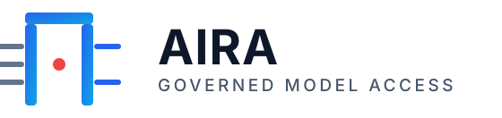
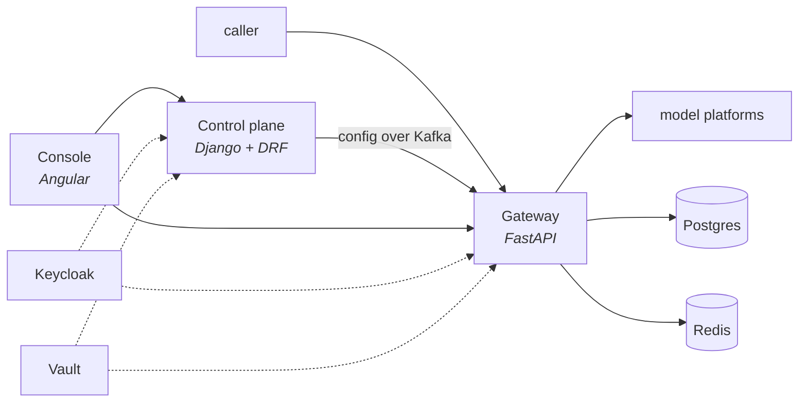
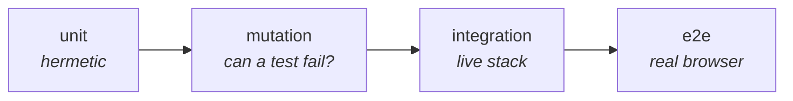

<p align="center">
  
</p>

<p align="center">
  <strong>An enterprise gateway for AI models.</strong><br>
  One API in front of several platforms, and a record of everything that passed through it.
</p>

---

AIRA sits between the people who want to call a model and the platforms that serve one. Every
request goes through the same controls in the same order — who is asking, on whose behalf, may they
afford it, may this model serve it — and every request leaves a row saying what happened, including
the ones that were refused.

It is deliberately **not** an agent platform. It provides auditable model access: no conversation
state, no retrieval, no tool execution, no workflow orchestration. The test for anything proposed
is whether it makes model access better governed and better evidenced, or whether it makes the
gateway think for the use case.

---

## See it working

```bash
make showcase
```

Starts everything in containers, pulls a small local model, seeds three use cases with budgets,
limits, pipelines, rules and keys, and drives **real traffic** through the gateway — including a
prompt injection the filter refuses. Then open <http://localhost:4200>.

| Sign in as | Password | To see |
|---|---|---|
| `admin` | `demo-password` | everything, including model prices and approval |
| `itsec` | `demo-password` | security oversight, and the content of requests |
| `itgov` | `demo-password` | every figure, no write anywhere, no content |
| `ucadmin` | `demo-password` | administering two of three use cases |
| `ucuser` | `demo-password` | a member's view |

Only Docker is needed. Step by step: [**Showcase**](docs/deployment/showcase.md).

---

## Deployment

Four ways to run it, one page each. Written for somebody doing it for the first time.

| | For | Needs |
|---|---|---|
| [**Showcase**](docs/deployment/showcase.md) | seeing the whole product work, with real traffic | Docker |
| [**Standalone**](docs/deployment/standalone.md) | running it on one machine, everything in containers | Docker |
| [**Development**](docs/deployment/dev.md) | changing the code, reload on save | Docker, Python 3.14 + uv, Node 26 |
| [**Integrated**](docs/deployment/integrated.md) | your infrastructure, your Keycloak, your models | see its access checklist |

---

## Features

Complete, and honest about what is not there. Anything unbuilt is in
[Gaps](#gaps-stated-rather-than-implied).

### Calling a model

- **Two API surfaces on one core.** The Gemini dialect (`/v1beta/models/…:generateContent`,
  `:streamGenerateContent`, `:embedContent`) and the predecessor KIRA contract
  (`/kira/api/external`), both served by the same provider-agnostic pipeline. Neither is a copy of
  the other: a test compares the audit rows the two produce.
- **Four model families, one namespace.** Gemini and Claude on Google Vertex (EU-regional), GPT and
  others on Microsoft Foundry, and any OpenAI-compatible server you run yourself.
- **Streaming**, as SSE for the Google SDK and as a JSON array by default.
- **Documents and images.** 15 media types with signature checks. A model that cannot read the
  attachment is **refused by name** — never sent the prompt without it, because a dropped attachment
  produces a confident wrong answer with a 200 and the caller blames the model.
- **Thinking budgets, structured output, batch embedding with task types.** Declared per model. One
  flag says *whether*; three vendors do each of these three unrelated ways the caller never sees.
- **Tool calling**, carried and never executed, off by default per use case.
- **Fallback chains** that skip a candidate that cannot serve the request and say which and why —
  rather than quietly answering with less than was asked for.
- **Nothing is silently dropped.** A field this gateway cannot honour is refused *by name* with the
  reason. Strictness is one-directional: responses still ignore fields they do not know, or every
  upstream release becomes an outage.

### Governing it

- **Use cases** as the unit of everything: access, budget, limits, pipeline, retention, reporting.
- **Two ways in.** API keys bound to a use case (hashed at rest, always with an end date), and
  Keycloak OIDC bearer tokens.
- **Access follows the group.** A grant binds a person *or* a Keycloak group to a use case. AIRA
  never writes to your directory.
- **Five roles**, and the differences between them are load-bearing:
  [**who may do what**](docs/ROLES.md).
- **Budgets** on spend, tokens or requests, per use case or per member, per day or per month.
  Reserved before dispatch and settled after, so concurrent requests cannot all pass a limit with
  room for one.
- **Rate limits** as token buckets over Redis, holding across replicas.
- **A pre-dispatch pipeline** per use case: prompt-injection filtering (heuristic or LLM-backed),
  model allow-lists, and LLM-classifier routing — built in the console as a graph, with inline help
  and a dry run.
- **An approved-model catalog.** Only models a Global Administrator has catalogued **and approved**
  may be used. Prices, capabilities, output caps and regions live there, and the gateway enforces
  them from its own read-model rather than asking the control plane on the request path.
- **Residency enforced, not intended.** A model outside the permitted regions stops the process at
  startup, and provider, publisher and region are on every audit row.
- **Secrets from Vault.** AppRole and KV-v2, ranked above the environment, failing closed: a
  configured Vault that cannot be reached stops the process rather than running on a stale value.

### Evidencing it

- **Every request is recorded** — served or refused. Rate-limited, over budget, unknown model,
  malformed, too large, client hung up: the log records what was *asked*, not only what was served.
- **What it cost.** Priced from the prompt/completion split in integer nano-units. Unpriced traffic
  is counted apart, never as zero.
- **What the model was asked to run.** Tool names and counts on the audit row — never the arguments,
  which are the caller's content.
- **Spend and usage reporting** with breakdowns by use case, model and member, and a CSV export that
  is a renderer of the same endpoint rather than a second one.
- **A request browser**, across use cases for the roles that investigate and inside one for the
  people who run it: which system, whose identity, which machine, what the pipeline objected to.
- **The prompts and answers themselves**, for the roles entitled to them — and **every read writes a
  record** of who read what, when, and on what authority.
- **Anomaly detection.** Seven rule kinds in a closed vocabulary, evaluated against the request log,
  including refusals. `alert` is the default because a system whose first setting is `block` blocks
  wrongly once and is switched off forever.
- **Incident response.** A suspension is a written decision with a target, an expiry, an author and
  a reason; it is read at the one pre-dispatch gate and kept after being lifted.
- **Per-use-case retention** for stored prompts, seven days by default, with payload storage
  switchable per use case and a kill switch above it.
- **Tracing** with `aira.*` span attributes, and a trace id on every response.

---

## How it is built



The two planes share nothing but events. The gateway never calls the control plane on the request
path, so a control-plane outage costs configuration changes, not traffic.

Full picture: [**Architecture**](docs/ARCHITECTURE.md) ·
[**One request end to end**](docs/REQUEST-LIFECYCLE.md).

---

## Documentation

| | |
|---|---|
| [**Roles**](docs/ROLES.md) | Who may do what, completely |
| [**Deployment**](docs/deployment/) | Showcase · standalone · development · integrated |
| [**Architecture**](docs/ARCHITECTURE.md) | Context, containers and components |
| [**Request lifecycle**](docs/REQUEST-LIFECYCLE.md) | Every control, in order, and what skipping one costs |
| [**Configuration**](docs/CONFIGURATION.md) | Every variable, what it does, what breaks without it |
| [**Integrations**](docs/INTEGRATIONS.md) | What each connected system must provide |
| [**Operations**](docs/DEPLOYMENT.md) | Running it: topics, jobs, degradation, backups |
| [**Testing**](docs/TESTING.md) | The four layers and why each exists |
| [**Gap analysis**](docs/GAP-ANALYSIS.md) | Requirements against what is built |
| [**Contributing**](CONTRIBUTING.md) | Conventions, and where the decision records live |

---

## Building it

```bash
make sync   # dependencies
make ci     # exactly what CI checks
make help   # every target
```

Four test layers, each for what the one below cannot see:



A green test proves that the code and the test agree — which they inevitably do when both came from
the same idea. So each guarded property is broken on purpose and the tests are required to notice.
The layers above unit exist because each has caught defects the one below structurally could not.

Details: [**Testing**](docs/TESTING.md).

---

## Gaps, stated rather than implied

- **Personal data in stored payloads is not redacted.** Credentials are; names and customer numbers
  deliberately are not, because they are what the payload is stored *for*. The control is the
  per-use-case storage switch.
- **No alert delivery.** Findings appear in the console; nothing sends mail or calls a webhook.
- **No model smoke tests.** How *models* behave — jailbreak resistance, refusal rates — is not
  measured.
- **No Kubernetes or Helm charts**, and no load or performance testing.
- **Microsoft Foundry is untested against a real Azure subscription.**

The full list with consequences: [**Gap analysis**](docs/GAP-ANALYSIS.md).

---

## Licence

Apache License 2.0 — see [`LICENSE`](LICENSE) and [`NOTICE`](NOTICE).
Documentation and code are written in English.
