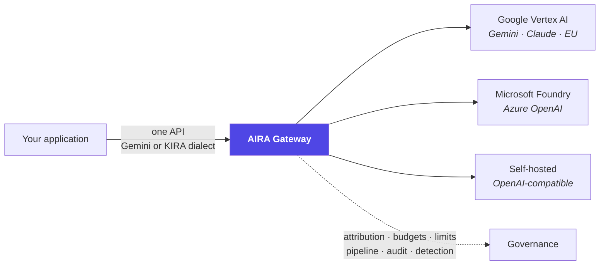
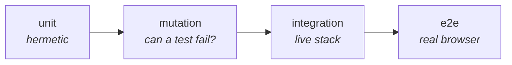

# AIRA Gateway — AI REST API

**One governed API in front of every LLM your organisation uses.**

A use case calls AIRA instead of calling Google, Microsoft or a self-hosted model directly. In
exchange the organisation gets attribution, budgets, rate limits, a configurable pre-dispatch
pipeline, a complete audit trail, spend reporting, anomaly detection and an incident kill switch —
without every team building any of it.

The scope is deliberately narrow: **auditable model access, not agents**. No retrieval, no
conversation state, no tool execution, no workflow orchestration
([`ADR-0013`](docs/adr/ADR-0013-auditable-model-access-not-agents.md)).



---

## Try it

```bash
make showcase
```

Starts everything in containers, pulls a small local model, seeds three use cases with budgets,
limits, pipelines and keys, and drives **real traffic** through the gateway — including a prompt
injection the filter refuses. Then open <http://localhost:4200>.

| Sign in as | Password | To see |
|---|---|---|
| `ucadmin` | `demo-password` | administering two of three use cases |
| `ucuser` | `demo-password` | a member's read-only view |
| `itsec` | `demo-password` | security oversight across every use case |
| `itgov` | `demo-password` | every figure, no write anywhere |
| `admin` | `demo-password` | everything, including model prices |

Only Docker is needed. `make showcase-traffic` drives more traffic; `make down-full` stops it. → [`docs/SETUP.md`](docs/SETUP.md)

---

## What it does

### For the people calling models

- **One API, several platforms.** Gemini-dialect REST (`/v1beta`) and the predecessor's KIRA
  contract (`/kira/api/external`), both over one provider-agnostic core.
- **Text, documents and images.** 15 media types with signature checks. A model that cannot read
  the attachment is **refused by name** — never sent the prompt without it, because a dropped
  attachment produces a confident wrong answer with a 200.
- **Thinking, structured output, batch embedding.** Declared per model; one flag says *whether*, and
  three vendors do it three unrelated ways the caller never sees.
- **Nothing is silently dropped.** A field this gateway cannot honour is refused *by name* with the
  reason, or the candidate is skipped — never accepted and ignored.

### For the people accountable for it

- **Attribution** per request: who, which system, which use case, which model, which region.
- **Budgets** in money, tokens or requests — per use case or per member, per day or month, reserved
  before dispatch so concurrent requests cannot all pass the same stale figure.
- **Rate limits** as token buckets over a shared store, so N replicas do not allow N × the limit.
- **A pipeline** per use case: prompt-injection filter, model allow-list, LLM-based routing, and a
  fallback chain that skips candidates it cannot honour.
- **A complete audit trail** — including refusals, because "the log records what was served, not
  what was asked" is how a leaked credential's blast radius becomes unknowable.
- **Spend and usage reporting**, on screen and as CSV.
- **Anomaly detection and incident response**: seven rule kinds evaluated against the audit trail,
  and suspensions with an author, a reason and an expiry.

### For the people running it

- Two stateless services, six processes, Postgres + Kafka + Keycloak, optional Redis, Vault and
  OTLP. Everything else is a container.
- **Degradation is decided**: without Redis, limits become per-instance rather than absent, and
  `/readyz` says so — and the audit row records which controls were degraded when it was written.
- **Safe defaults are enforced**: a dev secret, `DEBUG`, `ALLOWED_HOSTS=*`, a model outside the
  residency policy or an unreachable Vault all **refuse to boot**.

---

## Documentation

| | |
|---|---|
| 🏛 [**Architecture**](docs/ARCHITECTURE.md) | C4 context, containers and components, with diagrams |
| 🔄 [**Request lifecycle**](docs/REQUEST-LIFECYCLE.md) | One request end to end: every control, in order, and what it costs to skip |
| 🚀 [**Setup**](docs/SETUP.md) | Demo · standalone · development · integrated |
| ⚙️ [**Configuration**](docs/CONFIGURATION.md) | Every variable, what it does, what breaks without it |
| 🔌 [**Integrations**](docs/INTEGRATIONS.md) | What each connected system must provide: tokens, settings, checklists |
| 📋 [**Gap analysis**](docs/GAP-ANALYSIS.md) | Requirements against what is built — honestly |
| 🧪 [**Testing**](docs/TESTING.md) | The four layers and why each exists |
| 📦 [**Deployment**](docs/DEPLOYMENT.md) | Operational reference |
| 📐 [**ADRs**](docs/adr/) | Why each significant decision was made |
| 📄 [**FRDs**](docs/features/) | What each feature must do |
| 📓 [**Devlog**](docs/DEVLOG.md) · [**PRD**](docs/PRD.md) · [**Roadmap**](docs/ROADMAP.md) | History, requirements, plan |

---

## Development

```bash
make sync              # dependencies (Python 3.14 + uv, Node 26)
make ci                # everything CI checks: lint, types, unit tests with coverage gates
make test-integration  # against the live stack
make test-e2e          # real browser (Playwright)
make mutants           # break each guarded property and check the tests notice
make help              # every target
```

**Four test layers**, each for what the one below cannot see:



A green test proves the code and the test agree — which they inevitably do when both came from the
same idea. So each property is broken on purpose and the tests are required to notice: **301
properties** are guarded that way. The layers above unit exist because each has caught defects the
one below structurally could not — most recently a use-case bypass on one of the two API surfaces
that 271 mutation properties, a green gate and three other layers all missed, and that a single
request against the running stack made obvious. → [`docs/TESTING.md`](docs/TESTING.md)

Conventions and current status: [`CLAUDE.md`](CLAUDE.md).

---

## Status

**Phases 0–4 delivered, Phase 5 substantially.** Infrastructure and observability; the gateway with
auth, attribution, persistence, streaming and tracing; the control plane with RBAC and Kafka config
distribution; the Angular console; the pre-dispatch pipeline; budgets and cost control; rate
limiting; Vault; the KIRA compatibility surface; documents; Vertex EU with Gemini and Anthropic;
reporting and CSV export; and — from Phase 5 — anomaly rules, the detection engine and incident
response with a kill switch, its console, and a per-use-case request view.

Phase 5 is **not finished**: alert *delivery* (mail, webhook) is not built — the console is where a
finding is seen, not where it is sent — and model smoke tests (`FRD-504`) are not built.

**Known gaps, stated rather than implied** — redaction of *personal data* in stored payloads
(`FRD-406` masks credentials; PII is a deliberate non-goal), alert delivery,
model smoke tests (`FRD-504`), Foundry against a real Azure subscription, and
pagination. Each with its consequences: [`docs/GAP-ANALYSIS.md`](docs/GAP-ANALYSIS.md).

---

## Licence

Apache License 2.0 — see [`LICENSE`](LICENSE) and [`NOTICE`](NOTICE).

Documentation and code are written in English.
