# Architecture

The C4 view of AIRA Gateway: context, containers, components, and the decisions that shape them.

**It is meant to be readable on its own, and it starts plainly.** §1 says what the thing is in
ordinary words — the console, the gateway, and who stands in front of each. §1a adds the objects it
governs and the two loops it runs. §3a maps every directory in the repository onto that picture, so
a reader can go from a box in a diagram to the code behind it without asking anybody. Everything
after those is depth, and every link is a pointer to *more*, never to something needed in order to
follow the argument.

For the same request told control by control, with what each one costs if it is skipped, see
[`REQUEST-LIFECYCLE.md`](REQUEST-LIFECYCLE.md). For why a particular structure was chosen, the
[ADRs](adr/) are the record; this document points at them rather than repeating them.

> **Diagrams render on GitHub.** They are Mermaid, so they also render in most IDEs and in any
> Markdown viewer with Mermaid support. Where a diagram would only restate a list, there is a list.

---

## 1. What this is

### In plain words

AIRA stands between an organisation's people and programs on one side, and the companies that sell
AI models on the other. Without it, whoever wants a model calls Google or Microsoft directly with a
key somebody pasted somewhere, and afterwards nobody can say who asked what, what it cost, or
whether it should have been allowed at all. AIRA is the one door they all go through instead.

It has **two halves**, and what separates them is who is standing in front of it.

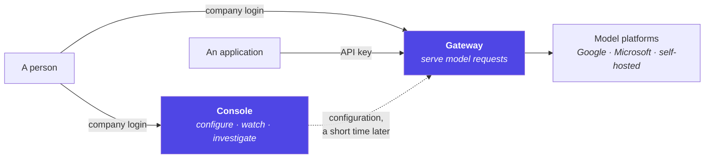

#### The console — where people work

A web page. A person signs in with their ordinary company login; AIRA never sees a password. What
they can do there depends on which groups they are in:

- A **use-case administrator** sets up and runs one purpose — "customer service chatbot", "coding
  assistant". They choose which models it may use, who may use it, how much it may spend a day, how
  fast requests may arrive, what is checked on each prompt before it is sent, and how long prompts
  are kept.
- **IT Security** writes the rules that watch the traffic, reads what those rules found, and can
  stop a use case or a single person immediately.
- **Governance** reads what was spent, by which use case and which person, and changes nothing.
- A **global administrator** maintains the list of models everybody may choose from, and their
  prices.
- A **member** of a use case sees that use case's own traffic — and, where permitted, the prompts
  themselves. Every such read is itself recorded.

**The console never talks to a model.** Two of its buttons make the *gateway* place a call — trying
a pipeline out before saving it, and putting the question catalogue to a use case — and those
travel the ordinary path, with the signed-in person's own identity on them.

#### The gateway — where programs work

An HTTP API. An application sends its prompt here instead of to the vendor: a chatbot with a
document search in front of it, a coding assistant inside somebody's editor, a job that runs
overnight turning a document store into vectors. It proves who it is with an **API key that belongs
to exactly one use case**, or — when a person is driving it — with the same company login the
console uses.

For every request, the gateway does what a direct call to a vendor cannot:

1. decides whether this caller may work at all right now — not stopped, not too fast, not out of
   money;
2. runs that use case's own checks over the prompt;
3. picks a model this use case is allowed to use **and** that can actually do what was asked;
4. sets the money aside before spending it;
5. forwards the request to whichever platform hosts that model, in that vendor's own format;
6. writes down what was asked, what was decided, what was served and what it cost — including when
   it refused;
7. returns the answer in the same format the caller sent.

A caller never has to know which company hosts the model. It names a model; the gateway knows where
that model lives and how to speak to it.

#### Who decides what — AIRA and the identity provider

**Keycloak answers who somebody is and which groups they are in. AIRA answers what those groups may
do.** Neither does the other's job, and everything below follows from that one split.

AIRA therefore reads exactly two things from a token: the **person** and their **group paths**. It
reads no Keycloak roles — assigning a realm role called `global-admin` to somebody has no effect
here — and it **never writes to the directory**: it creates no group, fills none, deletes none.

Access is decided in two layers, on purpose:

- **Across the installation.** A group path maps to a role (`/aira/it-security` → IT Security); a
  role holds named permissions; a caller's permissions are the union over the roles their groups
  confer. Every check asks for **one permission**, never for a role.
- **Inside one use case.** A **grant** binds a group — or one named person — to that use case as
  `user` (may call it, may see its figures) or `admin` (may also change its members, keys,
  pipeline, budgets and limits). Several routes may reach the same person; the **strongest wins**.

Being allowed to administer *a* use case must never mean administering *every* use case. That is
why the two layers are separate mechanisms rather than one list of roles.

Every gateway request belongs to **exactly one use case**: an API key *is* a use case, and a
person's login has to name one and is refused without a grant reaching it.

#### What this needs in Keycloak — the short list

For whoever administers the realm. Nothing here is AIRA-specific except the group *paths* you
choose, and those are yours.

| Needed in the realm | Why | Without it |
|---|---|---|
| A **client for the console**, public, authorization code + **PKCE** | The console runs in a browser and can keep no secret; PKCE stops a stolen code being redeemed by anyone else | No sign-in |
| A **group-membership mapper**: claim `groups`, **full path on**, in the *access* token, on every client whose tokens AIRA sees | Group membership is the only thing AIRA reads access from | Every group grant silently reaches nobody — a token with no groups looks exactly like one whose owner is in no group |
| An **audience mapper** putting `AIRA_OIDC_AUDIENCE` into `aud` | A token minted for another application must not be usable here; Keycloak does not add it by itself | Both services **refuse to start** outside a local environment |
| **`preferred_username`** in the access token (Keycloak's default) | Joins a person's browser session and their API key into one identity, so per-person budgets and a kill switch aimed at a person hit both | Each credential gets its own allowance; nothing is silently shared |
| **Edit username off** in realm login settings (the default) | The name in the token decides person-grants, per-head allowances and kill switches | Somebody can rename themselves into a colleague's access |
| **Three group paths** for the organisation-wide roles, named in `AIRA_ROLE_GROUPS` | This is how Global Administrator, IT Security and IT Steuerung are held | An installation nobody can administer; Management refuses to start without a Global Administrator group |
| A **read-only service account** with `view-users` and `query-groups` — nothing else | So the console can *search* your groups and people when somebody grants access | No role can be bound to a group at all: a group nobody could check is refused rather than trusted |

**Why it has to *ask* the directory at all** — the question an administrator asks first, and the
only reason any realm-management permission is requested:

A grant names a group **path**. A path typed from memory that matches nothing produces a grant that
applies to **nobody**, and nothing about it looks wrong — not in the console, not in the audit
trail, not until somebody reports they cannot reach a use case. So before a role or a use case is
bound to a group, Management asks Keycloak whether that path exists (`group-by-path`), once while
typing and again on save. `view-users` is the same thing for a grant that names **one person**
instead of a group, and is what lets the console offer a picker rather than a field for a directory
id.

Three properties of that lookup are worth stating to whoever grants it:

- **Read-only, and that is all it can be.** `view-users` and `query-groups` only — no
  `manage-users`, no `manage-realm`. AIRA creates no group, fills none and deletes none.
- **"You may not look" is never read as "it does not exist."** A `403` is treated as *unknown* and
  the binding is **refused** rather than admitted unverified — so a missing permission surfaces as
  an error naming the cause, not as a group that silently turns out to be empty.
- **It cannot be used to enumerate your directory.** The search strips `%` and `*` before sending,
  requires two literal characters and returns at most 25 entries. It is a picker, not a report.

Two things it explicitly does **not** need: no AIRA roles in the realm, and **no group per use
case** — an existing group is granted as it is, or the `/use-cases/<slug>` convention is used, which
needs no configuration at all. Group paths are matched **exactly**: a sub-group inherits nothing,
and `/aira/global-admins-readonly` confers nothing.

Realm-by-realm settings: [`INTEGRATIONS.md`](INTEGRATIONS.md) §2. The mechanics and the full
argument: §8.

#### What ties the two halves together

Everything set in the console reaches the gateway as **configuration**, a short time later, over a
message bus. The gateway never calls the console back — it decides from its own copy. That is why
the gateway keeps answering while the console is down, being upgraded, or simply busy.

### Precisely

AIRA Gateway puts **one governed API** in front of several LLM platforms. A use case calls it
instead of calling Google, Microsoft or a self-hosted model directly; in exchange the organisation
gets attribution, budgets, rate limits, a configurable pre-dispatch pipeline, a complete audit
trail, spend reporting, anomaly detection and an incident kill switch. The scope is deliberately
narrow ([`ADR-0013`](adr/ADR-0013-auditable-model-access-not-agents.md)): **auditable model access,
not agents** — no retrieval, no conversation state, no tool execution, no workflow orchestration.

---

## 1a. How it works, end to end

Two loops, and everything in this document belongs to one of them. The **serving loop** answers a
model request; the **configuration loop** changes what the serving loop will do next time. They
never call each other synchronously, and that separation is the single most consequential decision
in the design.

### The objects it governs

Read this table first: almost every sentence afterwards is about one of these.

| Object | What it is | Who owns it |
|---|---|---|
| **Use case** | One governed purpose for using AI — a chatbot, a coding assistant. Nearly everything the gateway does is attributed to exactly one. It carries its own members, released models, budgets, limits, pipeline, retention period and storage switches. | Management |
| **Grant** | Who may use or administer a use case — a Keycloak **group** path, or one person. Two routes to the same answer; the stronger role wins. | Management |
| **API key** | `aira_<prefix>_<secret>`, issued for **one** use case, hashed at rest, so an application can call without a person present. | Management issues, gateway verifies |
| **Model catalogue entry** | One model a caller may name: who serves it, how it is addressed, what it can do, what it costs. **Undeclared means unsupported.** | Management authors, gateway decides with |
| **Release** | Which catalogue entries *this* use case may call. A model can be approved installation-wide and still unavailable here. | Management |
| **Pipeline** | Ordered steps that run *before* dispatch for a use case: injection filter, model routing, PII redaction. Config, not code. | Management authors, gateway runs |
| **Budget** · **Rate limit** | How much may be spent and how fast requests may arrive, per use case and per person. Counted in Redis so the figure is shared across instances. | Management authors, gateway enforces |
| **Audit row** | One row per request that was *attempted* — served, refused, or abandoned mid-answer. The system of record for what happened. | Gateway |
| **Anomaly rule** · **Suspension** | A rule evaluated against the audit rows; a suspension is the resulting stop, applied on the next request. | Management authors the rule, gateway detects and enforces |

### Loop 1 — serving a request

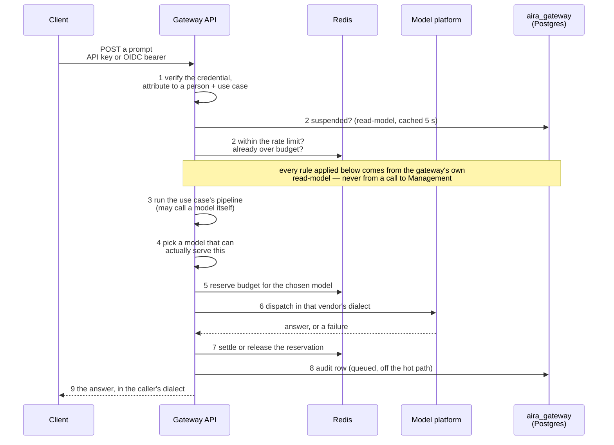

In words, and the order is the point:

1. **Who is this?** An API key is looked up by its prefix and compared against a stored hash; an
   OIDC token is verified against the realm's public keys. Either way the result is one
   attribution: a person, a credential, a use case. Nothing else in the request is trusted.
2. **Is this caller allowed to work at all?** Suspensions, then the rate limit, then "already over
   budget" — *before* the pipeline, because a refused caller must not pay for a classifier call
   first.
3. **The use case's own rules run.** The pipeline may inspect the prompt for injection, route the
   request to a different model, or rewrite text it must not forward. Each step's verdict is
   recorded, and a step that cannot decide blocks by default.
4. **Which model will actually serve it?** The catalogue says who hosts the named model and what it
   can do. A candidate that cannot honour the request — no tools, no document reading, wrong region
   — is skipped **by name**, never sent a silently reduced request.
5. **Budget is reserved against the model routing chose**, not the one the caller typed, and
   reserved *before* the call so two simultaneous requests cannot both fit into room for one.
6. **The call goes out** in the vendor's own wire format. This is the only place in the system that
   knows a vendor exists.
7. **The reservation is settled** against what was actually used, or released if nothing ran.
8. **One audit row is written** — for every request that reached this far, including the ones that
   were refused and the ones whose caller hung up mid-answer. It is queued to a background writer
   so persistence never sits on the request path.
9. **The answer is rendered** in whichever dialect the caller used.

Typical cost of all of this, measured: **48 ms of gateway CPU** for a chat request, **93 ms** for
an agentic one, against a model that takes seconds ([`DEPLOYMENT.md`](DEPLOYMENT.md) §1a).

### Loop 2 — changing the configuration

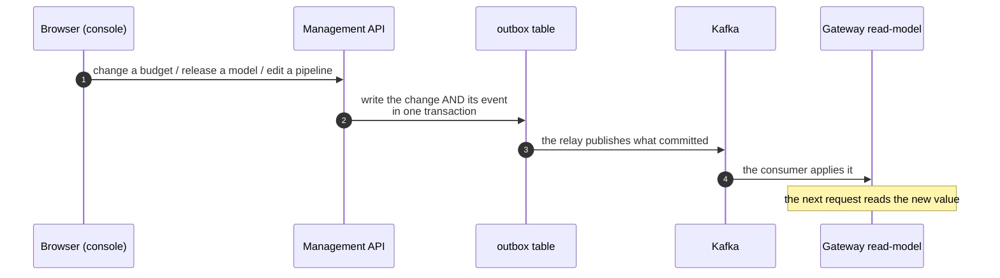

Why not a call from the gateway to Management? Because the data plane must be able to answer
without asking anybody. So Management **owns** configuration and the gateway keeps a local
**read-model** of it, fed by events on compacted Kafka topics. The gateway never calls Management
on the request path — not for a price, not for a capability, not for a rule. The cost of that
choice is honest and stated: a change is effective **after** the relay and the consumer have run,
not the instant it is saved.

The event is written in the same database transaction as the change it describes, so no event
exists for a change that rolled back and none is lost for one that committed.

**One deliberate exception.** The incident kill switch is written straight to the gateway. A
control that depends on the event bus fails exactly when the bus is the problem.

### What falls out of those two loops

- **Everything is attributed or refused.** There is no anonymous path to a model.
- **Evidence and enforcement read the same rows.** Anomaly detection runs over the audit trail and
  nothing else, so "the alert says X but the report says Y" is unreachable — and it sees refusals,
  where much of the signal is.
- **Under load nothing is rejected; it queues.** An instance past its capacity looks like a slow
  model from outside. Sizing is therefore a decision somebody has to make, not something the system
  makes for them.

### What it deliberately is not

Auditable model access, **not agents** ([`ADR-0013`](adr/ADR-0013-auditable-model-access-not-agents.md)):
no retrieval, no conversation state, no tool *execution* — tool calls are carried between client
and model, never run here — and no workflow orchestration. Each of those would put the gateway in
the position of deciding something it could not then audit.

---

## 2. C4 Level 1 — System context

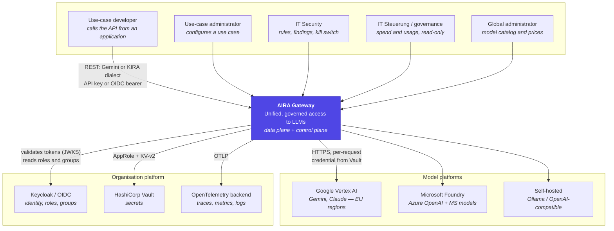

**The three organisation-wide roles** are conferred by **group membership** and by nothing else
([`ADR-0017`](adr/ADR-0017-a-role-is-held-through-a-group.md), amending
[`ADR-0009`](adr/ADR-0009-gateway-knows-roles.md)); both planes resolve the same `groups` claim
through `AIRA_ROLE_GROUPS`, and a realm role assigned directly grants nothing.
Two distinctions inside them cost real defects and are therefore explicit:

| Question | Predicate | Who |
|---|---|---|
| may **see** every use case | `has_oversight` | global-admin, it-steuerung, it-security |
| may see every **figure** | `is_governance` | global-admin, it-steuerung |
| may **act** in an incident | `may_act_on_incidents` | global-admin, it-security |

Collapsing the first two left IT Security with an empty console; collapsing the first and third let
a read-only governance role stop traffic. Both are recorded in
[`FRD-206`](features/FRD-206-console-truthfulness.md) and
[`FRD-503`](features/FRD-503-incident-response.md).

---

## 3. C4 Level 2 — Containers

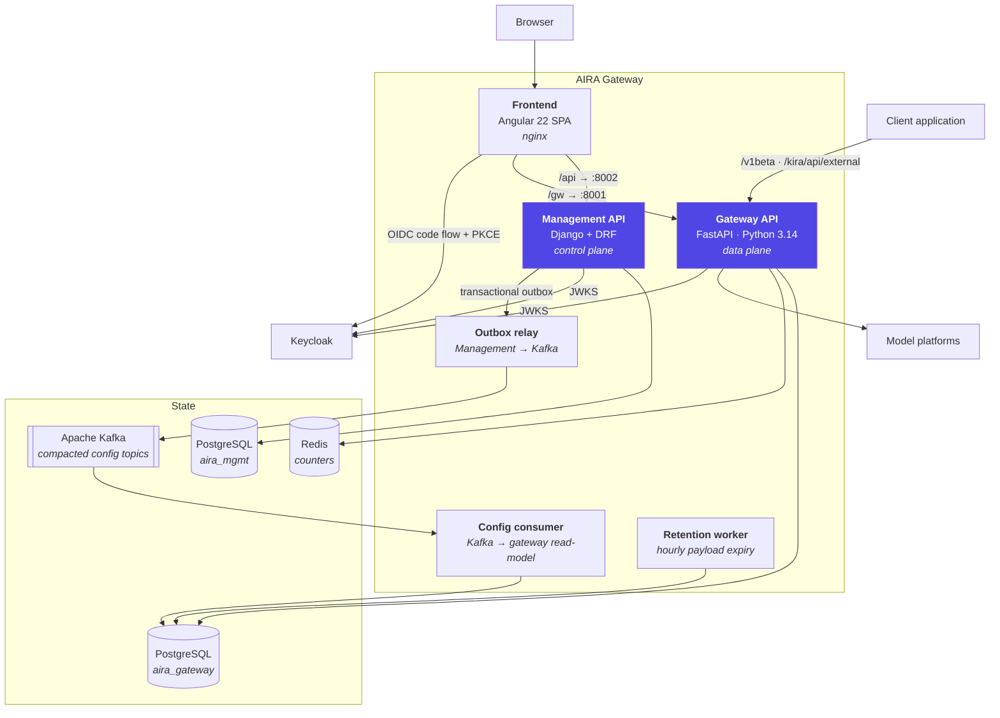

### Why two planes, and why they talk over Kafka

The data plane must answer a request without asking anybody. So Management **owns** configuration
and the gateway keeps a **read-model** of it: use cases, memberships, API keys, pipelines, budgets,
rate limits, the model catalog, anomaly rules and roles all arrive as events on compacted topics
([`FRD-204`](features/FRD-204-config-distribution-kafka.md)). The gateway never calls Management on
the request path — not for a price, not for a capability, not for a rule.

The event flow is a **transactional outbox**: `emit()` runs inside the same database transaction as
the change it describes, so an event is never published for a change that rolled back and never
lost for one that committed.

**One exception, deliberate**: the incident kill switch is written straight to the gateway
([`FRD-503` §4.3](features/FRD-503-incident-response.md)). A control that depends on the event bus
fails exactly when the bus is the problem.

### The containers, precisely

| Container | Image / entry point | Ports | What it is |
|---|---|---|---|
| `gateway` | `aira-gateway` · `uvicorn` | 8001 | The API clients call |
| `gateway-consumer` | same image · `python -m aira_gateway.consumer` | — | Applies config events to the read-model |
| `gateway-retention` | same image · `python -m aira_gateway.retention` | — | Deletes expired payloads hourly |
| `management` | `aira-management` · Django | 8002 | Control-plane REST API |
| `management-relay` | same image · `manage.py relay` | — | Publishes the outbox to Kafka |
| `frontend` | `aira-frontend` · nginx | 4200 | The SPA, plus `/api` and `/gw` proxies |

Migrations and topic creation run as one-shot containers before the long-lived ones
(`gateway-migrate`, `management-migrate`, `kafka-topics`); see
[`SETUP.md`](SETUP.md).

---

## 3a. What belongs to what — the repository, mapped

Every box in the diagrams above is code in this repository. This is the map from one to the other,
so that a reader can start at a concern and arrive at a file.

### Top level

| Path | Runs as | What lives here |
|---|---|---|
| `gateway/` | `gateway`, `gateway-consumer`, `gateway-retention` | The **data plane**: the API clients call, plus its two workers. **One image**, four entry points — the HTTP service, the config consumer, the retention pruner and `alembic upgrade head`. |
| `management/backend/` | `management`, `management-relay` | The **control plane**: the REST API the console talks to, and the process that publishes its outbox. Same image runs `manage.py migrate` and the demo seed. |
| `management/frontend/` | `frontend` | The Angular console, served by nginx, which also proxies `/api` to Management and `/gw` to the gateway. |
| `libs/` | imported by both | `aira_common` — everything both planes must agree about: the money type, the event shapes, the API-key format, the access rules, OIDC verification, Kafka and Vault clients. **A rule that exists in both planes lives here or it drifts.** |
| `deploy/compose/` | — | **Three files that combine** into the stack — infrastructure, the applications, the demo provisioning — and two overlays layered on with an extra `-f` when wanted: the sandbox and the load test. Which is which: `tools/compose_files.py`. See [`SETUP.md`](SETUP.md). |
| `tools/` | developer commands | Seeding, diagnostics, the mutation harness, the load harness, and the repository's own guard tests (`tools/tests/`). |
| `tests/integration/`, `e2e/` | opt-in test tiers | Against a live stack, and against a real browser. See [`TESTING.md`](TESTING.md). |
| `docs/` | — | This document, the decision records (`adr/`), one document per feature (`features/`), the change log (`DEVLOG.md`) and the rules this project has paid for (`LESSONS.md`). |

### Inside the gateway — `gateway/src/aira_gateway/`

Read it in the order a request travels.

| Path | What it is for |
|---|---|
| `main.py`, `app.py`, `state.py` | Wiring: build the application, start the background work, hand the components to the request path. |
| `middleware.py`, `cors.py`, `exception_handlers.py`, `security.py` | What runs outside any route: trace id, security headers, the body-size ceiling, the use-case path, and the startup refusal when a production deployment is configured like a laptop. |
| `auth/` | Turning a credential into an attribution: API keys, OIDC, group grants, and the failed-attempt bound. |
| `api/gemini/`, `api/kira/` | The two **surfaces**. They parse a wire format and render an answer, and do nothing else. |
| `api/serving/` | **The order.** `prepare.py` owns the pre-dispatch sequence, `accounting.py` owns every exit — served, refused, or abandoned. A surface calls these; it never assembles the steps itself. |
| `pipeline/` | The per-use-case steps and the dispatch chain: `engine/` runs the configured steps, `classifiers/` are the steps themselves (injection, routing, redaction), `dispatch.py` picks a model that can actually serve the request. |
| `catalog.py`, `requirements.py`, `residency.py`, `thinking.py`, `embedding.py`, `attachments.py`, `audio.py` | What a model may be asked for, and what it must be able to do to be asked. One question per module. |
| `ratelimit/`, `budgets/`, `scopes.py`, `pricing.py` | How fast and how much. `scopes.py` holds the scoping rule once, because budgets and limits scope identically. |
| `upstreams/` | **The only code that knows a vendor exists.** `vertex/`, `foundry/`, `openai/` per platform, each split into a transport (how to reach it) and a dialect (what the wire looks like); `mock.py` is the offline double. An architecture test fails if a vendor name appears anywhere else. |
| `core/canonical.py`, `core/schema.py` | The provider-agnostic request and answer everything above `upstreams/` speaks. |
| `persistence/` | The audit trail: `writer.py` (bounded queue, off the hot path), `redaction.py`, `sanitize.py`. |
| `audit.py`, `payloads.py` | What is recorded, and who may read stored content — every read being recorded in turn. |
| `anomalies/` | Detection over the audit rows, and the suspensions it produces. |
| `reporting/`, `api/reporting/`, `api/incidents/` | Spend and usage, their CSV export, and the incident actions. |
| `consumer/` | The second process: applies configuration events into the read-model. |
| `retention.py` | The third process: deletes expired payloads. |
| `db/` | The read-model and the audit tables as ORM models. Their **schema** is owned by `gateway/migrations/` (Alembic), a sibling of `src/`, never by the models. |
| `telemetry.py`, `diagnostics.py`, `routes/health.py` | Traces and metrics, upstream probing, `/healthz` and `/readyz`. |
| `cli.py` | Operator commands, including the break-glass key. |

### Inside Management — `management/backend/src/aira_management/`

| Path | What it is for |
|---|---|
| `apps/usecases/` | The centre of the control plane. `access.py` holds `may_admin`, `may_manage`, `is_member` — **one** definition, enforced by the viewsets *and* reported to the console so it cannot offer what the server refuses. |
| `apps/apikeys/`, `apps/pipelines/`, `apps/budgets/`, `apps/ratelimits/`, `apps/anomalies/`, `apps/catalog/` | One app per configurable object, each mirroring a section of §1a's table. |
| `apps/outbox/` | The transactional outbox and the relay that publishes it. |
| `apps/directory/` | The only thing AIRA asks Keycloak beyond signing keys: looking up people and groups so an administrator can pick them. |
| `apps/privacy/` | The generated privacy notice, and the register of every stored column that the test suite checks the schema against. |
| `apps/api/` | Authentication, error envelopes, routing — the plumbing every app shares. |
| `apps/seed/`, `apps/smoketests/`, `apps/health/` | Demo data, the "ask the model" check, readiness. |
| `rbac.py`, `roles.py` | Roles from Keycloak groups, and object permissions through `django-guardian`. |

### Inside the console — `management/frontend/src/app/`

| Path | What it is for |
|---|---|
| `features/use-cases/` | The page most work happens on: a parent that loads and owns the tab bar, and one child per tab owning its own form state. |
| `features/pipelines/`, `features/models/`, `features/governance/`, `features/reporting/`, `features/security/`, `features/requests/`, `features/privacy/`, `features/platform/`, `features/smoketests/` | One folder per screen, each reading whichever plane owns its data. |
| `core/api/` | Typed clients for both planes, and `error-message.ts` — every load and mutation reports its outcome through it, so there are no silent failures. |
| `core/auth/` | The OIDC code flow with PKCE; the console holds no long-lived credential. |
| `core/ui/` | The primitives shared rather than rewritten per page — each because the second copy went wrong: `live.ts` (polling that stops, is visible and never stacks), `info-hint` (the explanation beside a figure), and `table-view`/`table-pager` with their server- and cursor-paged siblings. |

### Where to start reading

| If you want to understand… | Start at |
|---|---|
| what one request does | `api/serving/prepare.py`, then `accounting.py` |
| how a vendor is added | `upstreams/openai/` — the smallest complete example of transport × dialect |
| what a use case may do | `libs/src/aira_common/access.py` and `apps/usecases/access.py` |
| how configuration travels | `apps/outbox/`, then `gateway/consumer/apply.py` |
| what is recorded | `gateway/audit.py`, then `persistence/writer.py` |

---

## 4. C4 Level 3 — Inside the Gateway API

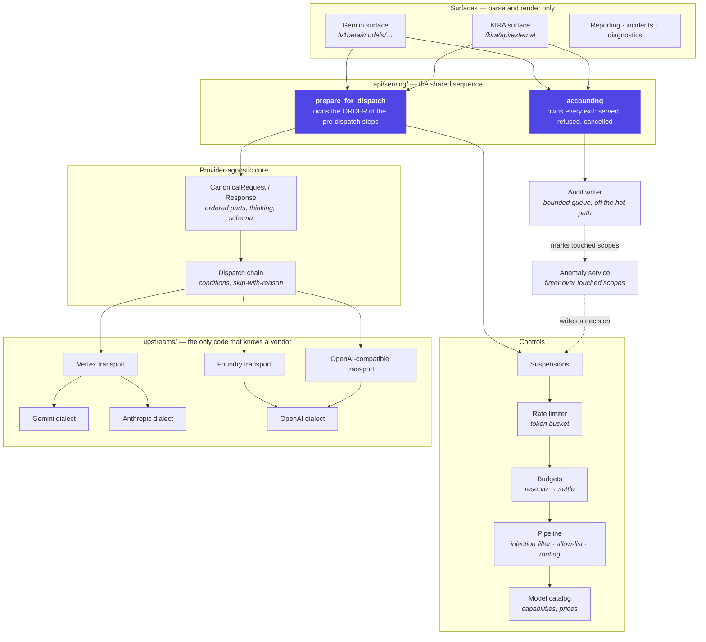

### The three structural rules

**A surface parses; the layer decides.** Both API dialects call `prepare_for_dispatch` and
`accounting` rather than assembling the steps themselves. Every guarantee that layer makes is a
guarantee about the *order* — rate limit before the pipeline, declaration after routing, reservation
last — and an order cannot be shared by sharing the steps. A test
(`test_surface_layering.py`) fails on a surface that calls a step directly.
([`FRD-126`](features/FRD-126-one-pre-dispatch-sequence.md),
[`FRD-128`](features/FRD-128-one-post-dispatch-sequence.md))

**Transport × dialect × model identity.** A transport owns reaching a cloud (endpoint, credential,
region); a dialect owns the wire shape; the caller's model name is never the platform's addressing.
An architecture assertion parses every module outside `upstreams/` and fails if a vendor name
appears in code. ([`ADR-0011`](adr/ADR-0011-upstreams-platform-dialect-identity.md))

**Hide the plumbing, declare the semantics.** Capability flags say *whether*, never *how*, and
**undeclared means unsupported**. A difference that changes the *answer* is never hidden: a model
that cannot read the attachment is skipped by name, not sent the prompt without it.
([`ADR-0012`](adr/ADR-0012-one-catalog-many-platforms.md),
[`FRD-114`](features/FRD-114-model-capability-metadata.md))

---

## 5. C4 Level 3 — Inside the Management API

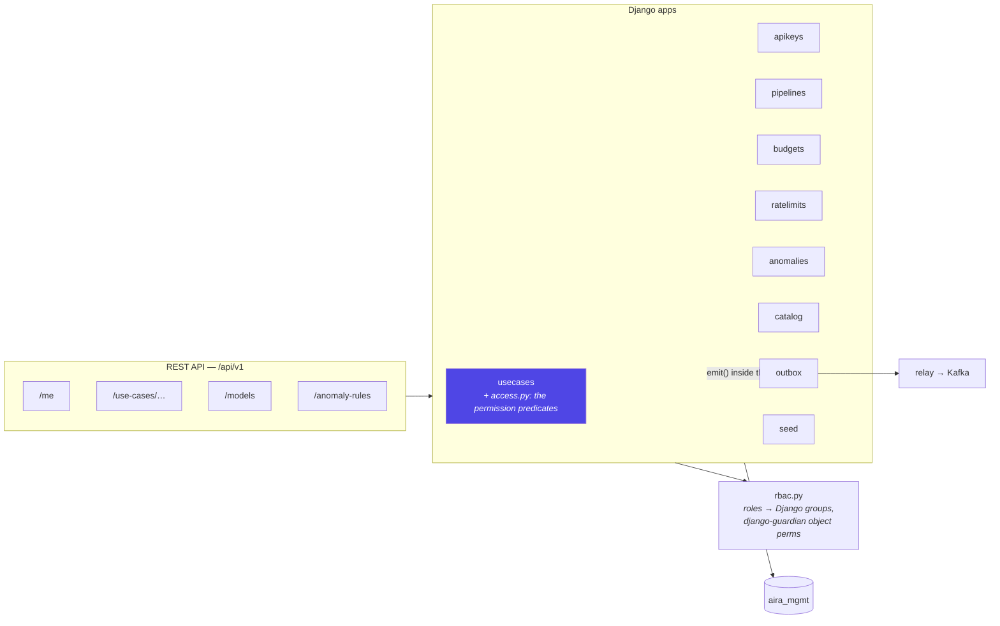

**One definition of who may do what.** `apps/usecases/access.py` holds `may_admin`, `may_manage`
and `is_member`; the viewsets enforce with them *and* the serializer reports them to the console, so
the console cannot offer an action the server refuses. An agreement test attempts each request and
requires the status to match what the object reported.
([`FRD-206`](features/FRD-206-console-truthfulness.md))

**Who reaches a use case, and how the two planes agree about it.** A grant binds a **principal** —
a Keycloak group or a person — to a use case with a role. A group grant assigns the object
permissions to a Django group mirroring the Keycloak path, and every authenticated request syncs the
caller's group paths onto their Django groups, so `django-guardian` answers user-and-group
permissions in one query and the predicates above needed no change. The gateway resolves the same
question from the token's `groups` claim against a read-model table fed over Kafka, with the
`/use-cases/<slug>` convention still resolving from the token alone. The two routes are a **union**
and the stronger role wins; both rules live once, in `aira_common.access`.
([`FRD-209`](features/FRD-209-access-by-group.md))

**The SPA's screens**, and which plane each reads: use-case list/detail (management), the pipeline
builder (management, dry-run against the gateway), budgets and rate limits (management, consumption
from the gateway), models and prices (management), reporting and its CSV export (gateway) — with
the **installation's own budget** on that same screen, because the figure it bounds is already there
as the `(none)` row of *By use case* ([`FRD-610`](features/FRD-610-nothing-spends-outside-a-bucket.md))
— the **Security console** and per-use-case **Warnings** and **Traces** (gateway). The last three refresh
themselves through one primitive, `core/ui/live.ts`: it polls, it stops on destroy and while the tab
is hidden, it never stacks a request behind a slow one, and it shows the reader how stale the view is
with a switch to turn it off ([`FRD-502`](features/FRD-502-security-console-and-traces.md)).

Three primitives are shared across those screens rather than written per page, each because the
second copy went wrong: `core/ui/live.ts` (polling that stops, is visible and never stacks),
`core/ui/info-hint` (the hover/focus/pin explanation beside a figure or a control) and
`core/ui/table-view` + `table-pager` (search and paging, client-side, for lists that arrive in one
response). ([`FRD-207`](features/FRD-207-console-legibility.md))

---

## 6. Data stores, and what each is for

| Store | Holds | Why this one |
|---|---|---|
| `aira_mgmt` (Postgres) | use cases, memberships, keys (hashed), pipelines, budgets, limits, rules, catalog, outbox | System of record for **configuration** |
| `aira_gateway` (Postgres) | read-model of all of the above, plus `use_case_groups`, `request_logs`, `anomaly_events`, `access_suspensions`, `budget_usage` | System of record for **what happened**; the gateway cannot serve without it |
| Redis | rate-limit buckets, budget reservations | Shared counters across replicas; written on **every** request ([`ADR-0008`](adr/ADR-0008-redis-shared-counters.md)) |
| Kafka | compacted config topics | Ordered, replayable configuration distribution |
| Vault | credentials | Read as a **settings source**, never injected into `os.environ` ([`FRD-116`](features/FRD-116-vault-secrets.md)) |

**Degradation is decided, not accidental.** Without Redis, rate limits fall back to a per-instance
bucket (bounding, not fail-open) and budgets to the Postgres path (enforcing but racy); `/readyz`
answers 200 with `degraded: true`, and the degradation is frozen onto each audit row so a request
can be read in the light of the conditions it met.

---

## 7. Where the money and the evidence live

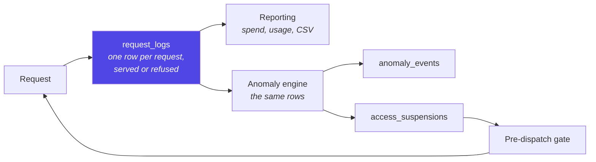

Detection reads **the audit trail and nothing else**
([`ADR-0014`](adr/ADR-0014-detection-is-asynchronous-enforcement-is-not.md)). Two consequences,
both wanted: a detector cannot see anything the report cannot, so "the alert says X but the report
says Y" is unreachable — and it sees *refusals*, which is where much of the signal is.

Money is **integer nano-units, never a float**, and crosses APIs as decimal strings
([`FRD-403`](features/FRD-403-cost-budgets.md)). Unpriced traffic is counted apart, never as zero —
and a *refused* request is neither: nothing ran, so its cost is a genuine zero rather than an
unknown.

---

## 8. Authentication — who proves what, to whom

**In short.** Every person and every application that reaches AIRA has to prove who it is, and
everything AIRA records or refuses afterwards hangs off that proof. People prove it with a login at
the organisation's own identity provider (Keycloak); applications prove it with an API key AIRA
issued for one use case. AIRA checks both itself, on the spot, without asking Keycloak on each
request: a person's token is verified against the realm's public signing keys, and a key against a
hash in the database. What a caller may then *do* never comes from the token — the token says who
they are and which groups they are in, and AIRA decides from its own configuration what those
groups are allowed to do. There is no third way in: no local password, no shared admin account, and
no API key that reaches the control plane.

### 8.1 The three kinds of caller

Keycloak issues every token, and AIRA verifies each one itself against the realm's public signing
keys. **No request is answered by asking Keycloak whether a caller is valid**; the keys are cached
for minutes at a time and fetched again when that cache lapses, or when a token names a signing key
AIRA has not seen yet — which is what makes a key rotation heal itself. The only
other calls to Keycloak are Management's read-only directory lookups, used while somebody is
granting access in the console.

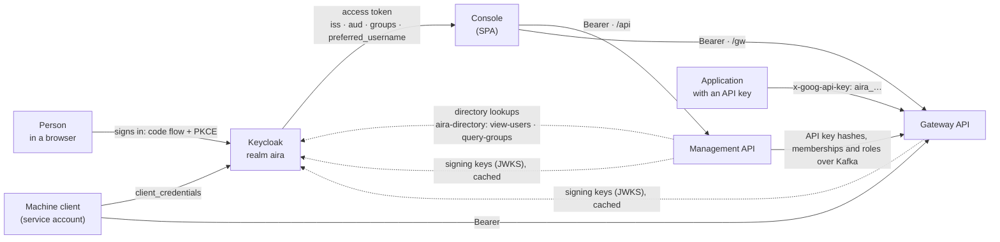

Three kinds of caller, and nothing else reaches either service:

1. **A person in the console.** They sign in at Keycloak; the console holds the resulting token and
   sends it to both APIs.
2. **An application with an API key.** It calls the gateway only, and only inside the one use case
   the key was issued for.
3. **A machine client of the organisation** (a Keycloak service account, for a scheduled job or
   another system). It fetches a token from Keycloak with its own client credentials and is then
   treated like a person: the same verification, the same groups, the same rules.

### 8.2 A person signing in

The console is a browser application with no secret of its own, so it uses the authorization-code
flow with PKCE — the flow designed for exactly that situation.

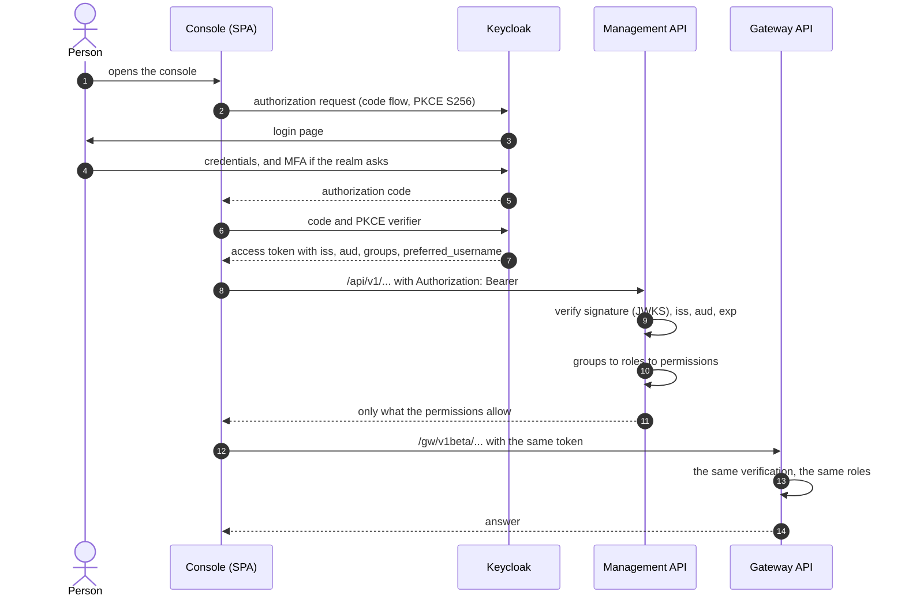

In words, for a reader who cannot see the diagram:

1. The person opens the console. Finding no valid token, it sends them to Keycloak, remembering a
   one-time secret (the PKCE verifier) that never leaves the browser.
2. Keycloak shows its own login page and applies whatever the organisation requires there —
   password, MFA, a hardware token. **AIRA never sees any of it.**
3. Keycloak sends the browser back with a short-lived authorization code.
4. The console exchanges that code, together with the PKCE verifier, for an access token. Without
   the verifier the code is worthless, which is what makes it safe for an application that cannot
   keep a secret.
5. The console calls the Management API and the Gateway API with the same token in an
   `Authorization: Bearer …` header. Each service verifies it independently — neither trusts the
   other, and neither trusts the console.
6. The token is kept in the browser tab's session storage and is gone when the tab closes. The
   console sets no cookies of its own and holds no long-lived offline token: when the session at
   Keycloak ends, access to AIRA ends with it.

### 8.3 What both services check on a token

Every request carrying a token is checked against four things, in the service itself:

| Checked | Why it matters |
|---|---|
| **Signature**, against the realm's published keys (JWKS) | Proves the token was issued by that realm and has not been altered. The keys are cached, so this costs no call to Keycloak on a normal request. |
| **`iss` (issuer)**, compared literally with the configured address | Keycloak writes `iss` from the address the token was requested through. Comparing literally means a token obtained through some other address — a second hostname, a proxy nobody expected — is refused instead of quietly accepted. |
| **`aud` (audience)** | Says which client the token was minted for. Without it, *any* token from the realm would be accepted, including one issued to an unrelated application. A deployment outside local development refuses to start without an audience configured. |
| **`exp` (expiry)**, with a small tolerance for clock drift | A token is only valid for minutes. The tolerance (default: 60 seconds for a clock running ahead, none past expiry) exists because two servers are never perfectly in step, and a one-second difference would otherwise refuse every freshly issued token. |

Two details worth knowing:

- **The gateway can trust more than one realm.** An organisation that is mid-migration, or that has
  merged, can configure several issuers; a token is routed by its own `iss` to the realm it names
  and then verified properly against that realm. Each realm brings its own audience and keys. The
  Management API trusts exactly one realm.
- **Verification costs no round trip.** The only network call is fetching the signing keys, and that
  answer is cached and shared by every request.

### 8.4 From groups to permissions — why roles are not in the token

A token says which **groups** a person is in. It does not say what they may do in AIRA, and that is
deliberate:

- **One source of truth for membership.** Adding somebody to a use case, or to IT Security, is done
  once in the identity provider — where joiners and leavers are already handled — instead of in a
  second place that has to be kept in step.
- **Access can be changed without touching the identity provider.** What a role is *allowed to do*
  is AIRA's own configuration; an installation can create its own roles and change their
  permissions without asking anybody to edit the realm.
- **Withdrawal is immediate and reviewable.** Permissions are read per request from AIRA's own data,
  so a change applies to the next request rather than when the person's token happens to expire.

Concretely, and **in two layers that are deliberately not the same mechanism**:

- **Installation-wide.** Configuration maps a group path to a role (`/aira/it-security` → IT
  Security); each role holds a set of named permissions; a caller's permissions are the union over
  every role whose group their token carries. Two roles are fixed in code and never read from a
  table, so a broken role row cannot lock everybody out: `global-admin` holds every permission by
  construction and `it-security` a fixed set. `it-steuerung` and any role an installation adds are
  data (`aira_common/permissions.py`). A group path is matched **exactly and never as a prefix**, so
  `/aira/global-admins-readonly` cannot confer what `/aira/global-admins` does
  ([`FRD-605`](features/FRD-605-roles-from-groups.md) FR-3).
- **Inside one use case.** A **grant** binds a principal — a Keycloak group path, or one named
  person — to that use case as `user` or `admin` (`aira_common/access.py`). `user` may call the
  gateway attributed to it and read its figures; `admin` may additionally change its members, keys,
  pipeline, budgets and limits. Several routes may reach the same person, and the **strongest role
  wins** rather than the one whose row happens to be read first. The `/use-cases/<slug>` convention
  ([`FRD-102`](features/FRD-102-attribution.md)) still resolves from the token alone, as one route
  among several — it needs no grant and no read-model lookup, which is why the demo realm uses it.

Management owns both and publishes them to the gateway over Kafka (`aira.roles`,
`aira.memberships`), so both planes answer the same question the same way. A realm role assigned
directly in Keycloak grants nothing in AIRA — only group membership does
([`ADR-0017`](adr/ADR-0017-a-role-is-held-through-a-group.md),
[`ADR-0025`](adr/ADR-0025-aira-defines-what-a-role-may-do.md),
[`FRD-209`](features/FRD-209-access-by-group.md)).

### 8.5 An application with an API key

A key exists so that an application can call the gateway with nobody sitting in front of it, while
every request still belongs to a named person and one use case.

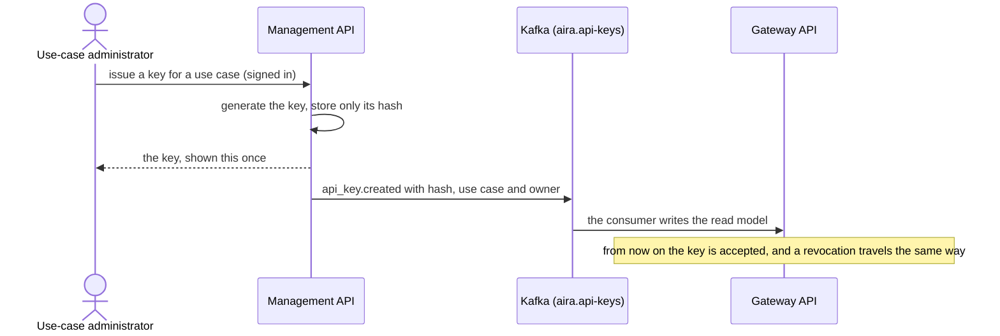

What that means in practice:

- **The key is shown once.** AIRA stores only a SHA-256 hash of it, plus the short, non-secret
  prefix used to find the row. A lost key cannot be recovered, only replaced — and a copy of the
  database does not contain any usable key.
- **A key belongs to one use case and one owner.** Every request made with it is recorded under that
  person's name, which is why issuing a key for a colleague is a deliberate, recorded act.
- **A key always expires.** 30 days by default, at most 180 (both configurable). Neither the
  console nor the command line offers a key without an end date, because a credential that never
  expires is one somebody has to remember to take away.
- **Revocation and issuance travel the same way**, over Kafka, and take effect within seconds.
- **The control plane accepts no keys at all.** A key reaches the gateway and nothing else, so a
  leaked key can spend budget but cannot change configuration, read the roles or grant access.

### 8.6 A request to the gateway, step by step

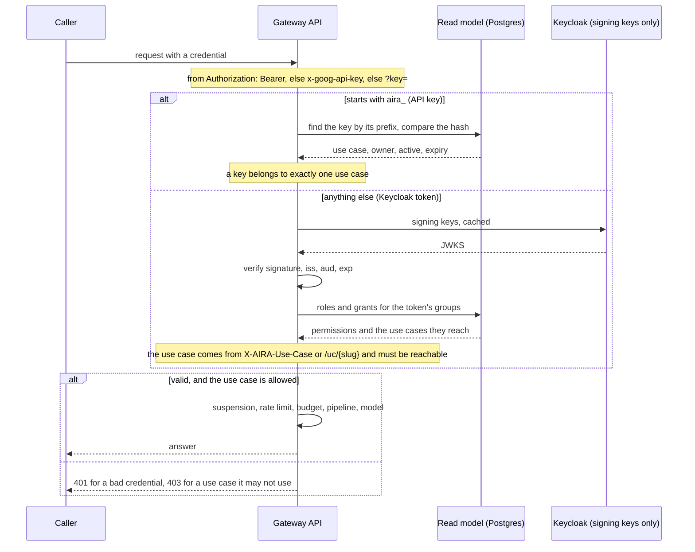

1. **Find the credential.** `Authorization: Bearer …` first, then the `x-goog-api-key` header, then
   `?key=`. The last two exist so that clients written for Google's Gemini API work against AIRA
   unchanged.
2. **Decide what it is by its shape.** A credential beginning with `aira_` is an API key; anything
   else is treated as a token. Nothing else distinguishes them, and no caller can choose the path.
3. **Check it.** A key is looked up by its prefix and its hash compared in constant time; the row
   also says whether it is still active and not expired. A token goes through the four checks
   in §8.3.
4. **Decide which use case the request belongs to.** The `X-AIRA-Use-Case` header wins; otherwise a
   `/uc/<slug>` path segment. For a key issued by Management, the use case is the key's own and
   needs no selector. **A selector never grants access — it only chooses among what the caller
   already has.** Naming a use case the caller is not in is refused.
5. **Then the governed part of the request begins** — whether that caller is currently stopped,
   rate limits, budgets, the use case's pipeline, and which model it may use. That is
   [`REQUEST-LIFECYCLE.md`](REQUEST-LIFECYCLE.md).

A read-only call (`GET`, `HEAD`, `OPTIONS`) needs no use case: listing what is configured spends
nothing, and an administrator who is a member of no use case must still be able to read the
catalogue.

**What is refused, and with which answer:**

| Answer | When |
|---|---|
| `401` | No credential, or one that does not verify: bad signature, wrong issuer or audience, expired, unknown or revoked key. The answer never says which — that would tell a prober how close they are. |
| `403` | A valid credential asking for a use case it may not use: not a member, or a key bound to another use case. |
| `400` | A use case named in a form that is not a valid identifier, or none named where one is required. |
| `429` | Too many **refused** authentication attempts from one source address (default 60 a minute, on both planes). Successful requests never touch that counter, so an ordinary integration cannot trip it, however busy. `Retry-After` says when to come back. |

### 8.7 Directory lookups — the one thing AIRA asks Keycloak

When somebody grants access in the console, they need to find a colleague or a group that may never
have signed in to AIRA. That is the only case in which AIRA queries Keycloak's admin API, with a
dedicated read-only service account:

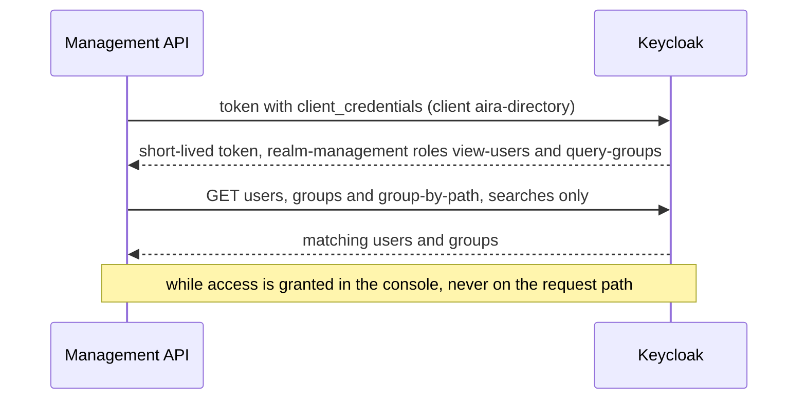

The account can read users and groups and nothing else — it cannot create, change or delete
anything in the realm. Without it the console still works: it then searches only the people AIRA
already knows and says so. Binding a role to a group is refused while the directory cannot be asked,
because a group nobody could verify is not one to grant access from.

### 8.8 The guard rails around all of this

- **Nothing is stored in the clear.** Keys are hashed; the realm's client secret and the database
  password come from Vault, not from the environment.
- **Both planes bound refused authentications** per source address, because every other limit in the
  system is keyed to a verified identity and therefore bounds nobody who has none.
- **The console holds no long-lived credential.** No offline token, no cookie of its own, nothing
  that outlives the session at Keycloak.
- **A demo may run without authentication, and only a demo.** With `AIRA_AUTH_REQUIRED` off every
  route is served to anybody who can reach the port, so a deployment outside local development
  refuses to start that way — and `AIRA_DEMO_MODE`, which waives several other checks, deliberately
  does not waive this one
  ([`ADR-0015`](adr/ADR-0015-a-convenience-default-is-a-production-default.md)).
- **There is one emergency credential, and it is an ordinary key otherwise.** An operator with
  database access can mint a "break-glass" key on the gateway's command line for when the control
  plane itself is unavailable. It expires like any other key, its prefix and owner are on every
  request it makes, and it can be revoked the same way. What it lacks is a use case of its own, so
  whoever uses it has to name one on every call.
- **Every refusal is evidence too.** A request refused before it is attributed writes no audit row,
  so who was refused, from where, and why is recorded on its trace instead.

What the realm has to provide, setting by setting — clients, group paths, the audience mapper and
the directory account — is [`INTEGRATIONS.md`](INTEGRATIONS.md) §2; the variables that configure it
are in [`CONFIGURATION.md`](CONFIGURATION.md).

---

## 9. Reading further

| For | Read |
|---|---|
| One request, end to end | [`REQUEST-LIFECYCLE.md`](REQUEST-LIFECYCLE.md) |
| Running it | [`SETUP.md`](SETUP.md) |
| Every environment variable | [`CONFIGURATION.md`](CONFIGURATION.md) |
| Connecting real systems | [`INTEGRATIONS.md`](INTEGRATIONS.md) |
| Why a decision was made | [`adr/`](adr/) |
| What a feature must do | [`features/`](features/) |
| What is not built yet | [`GAP-ANALYSIS.md`](GAP-ANALYSIS.md) |
