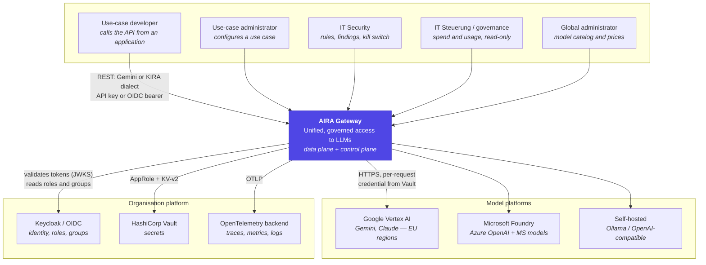
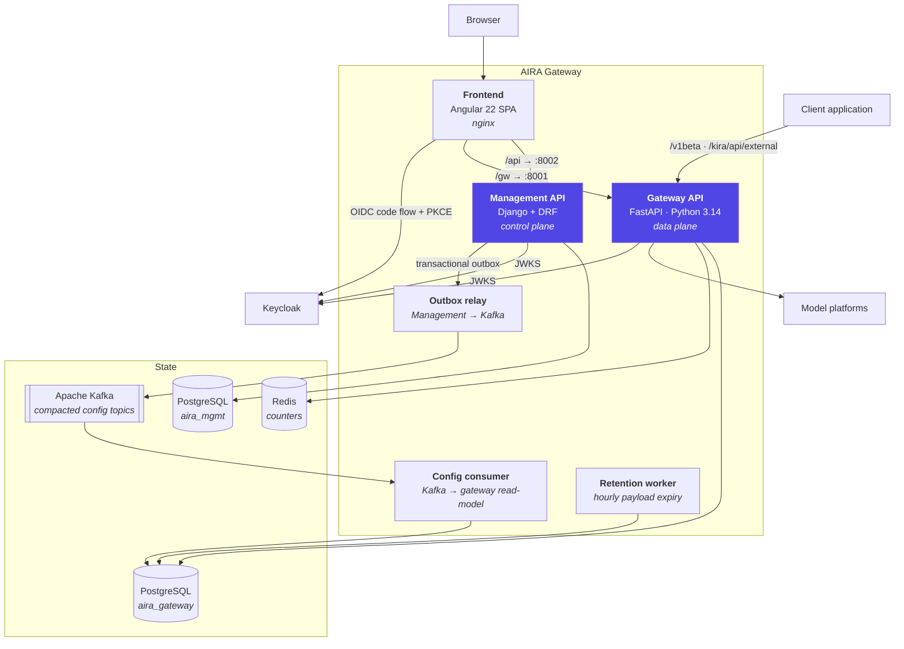
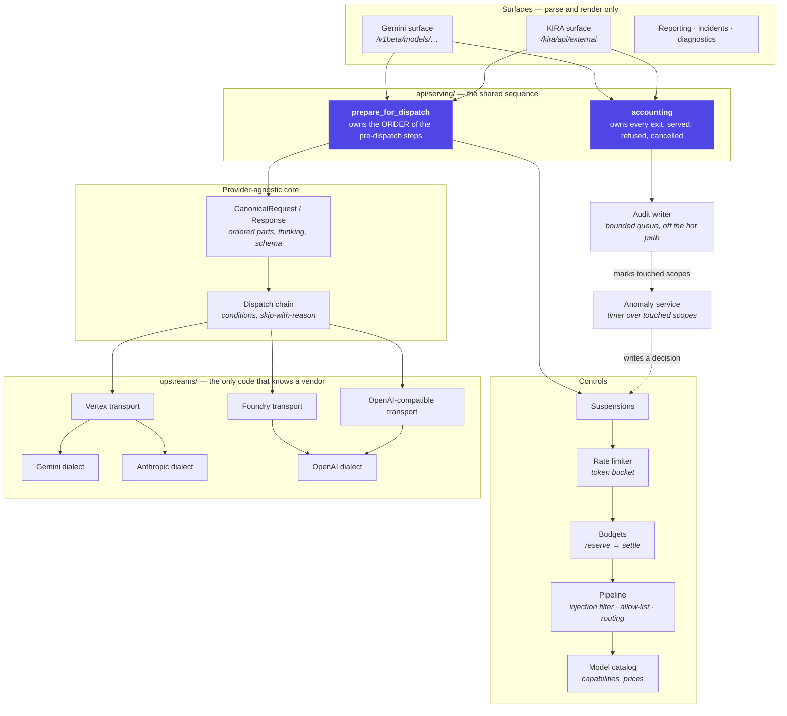
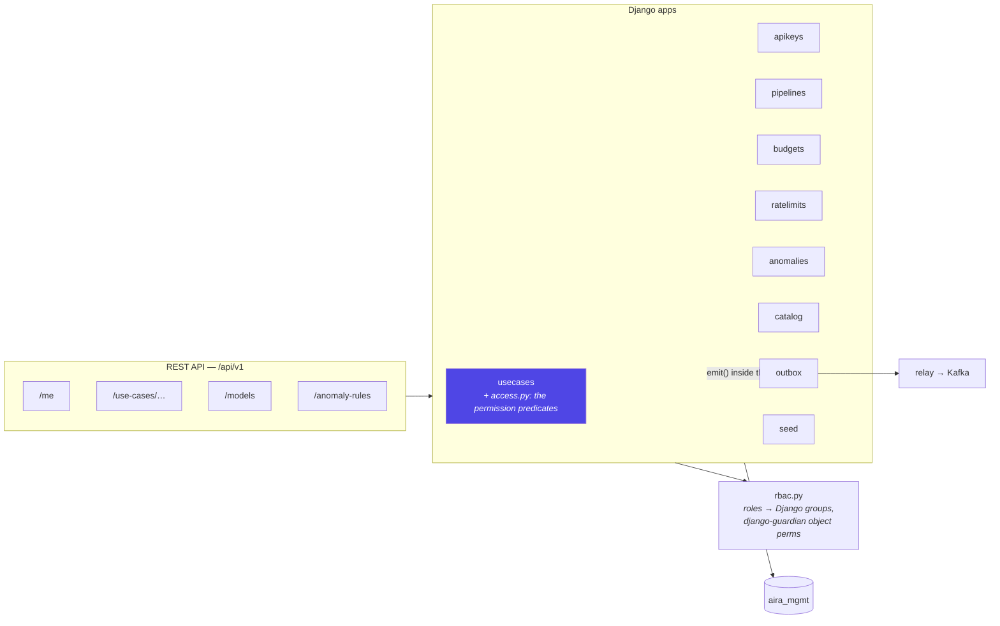
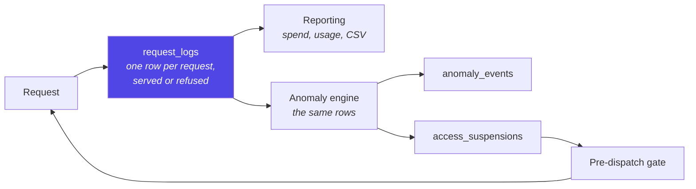
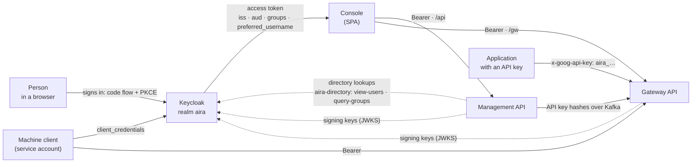
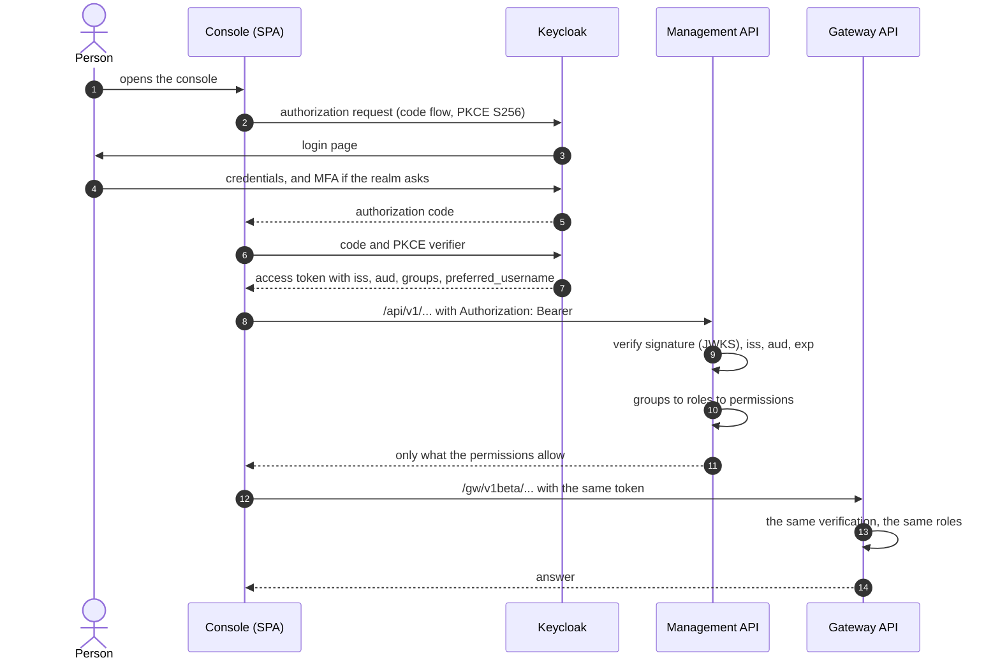
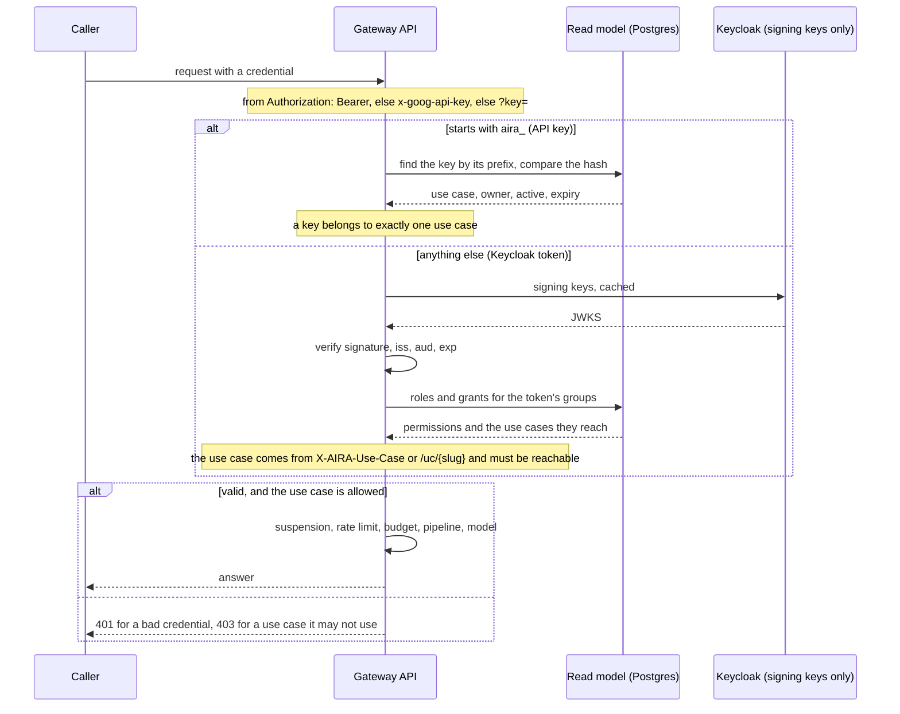
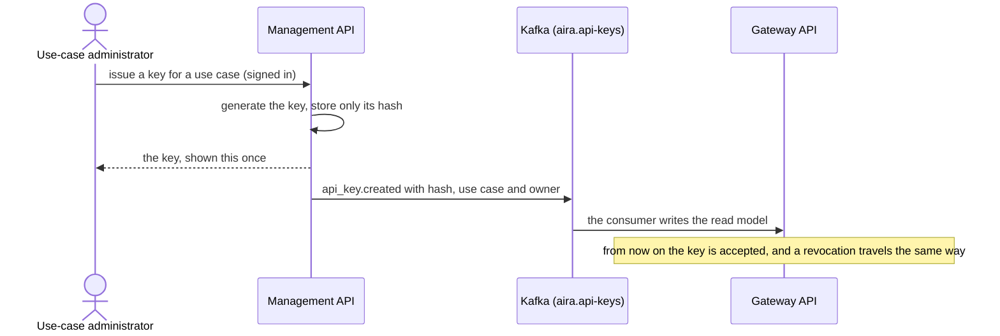
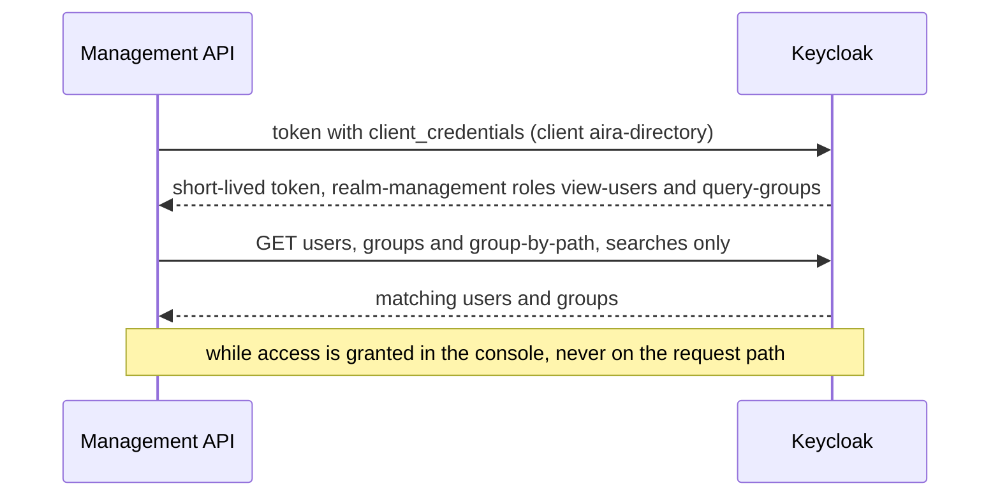

# Architecture

The C4 view of AIRA Gateway: context, containers, components, and the decisions that shape them.

For the *runtime* story — what happens to one request from the moment it arrives — see
[`REQUEST-LIFECYCLE.md`](REQUEST-LIFECYCLE.md). For why a particular structure was chosen, the
[ADRs](adr/) are the record; this document points at them rather than repeating them.

> **Diagrams render on GitHub.** They are Mermaid, so they also render in most IDEs and in any
> Markdown viewer with Mermaid support. Where a diagram would only restate a list, there is a list.

---

## 1. What this is, in one paragraph

AIRA Gateway puts **one governed API** in front of several LLM platforms. A use case calls it
instead of calling Google, Microsoft or a self-hosted model directly; in exchange the organisation
gets attribution, budgets, rate limits, a configurable pre-dispatch pipeline, a complete audit
trail, spend reporting, anomaly detection and an incident kill switch. The scope is deliberately
narrow ([`ADR-0013`](adr/ADR-0013-auditable-model-access-not-agents.md)): **auditable model access,
not agents** — no retrieval, no conversation state, no tool execution, no workflow orchestration.

---

## 2. C4 Level 1 — System context

**The three organisation-wide roles** are conferred by **group membership** and by nothing else
([`ADR-0017`](adr/ADR-0017-a-role-is-held-through-a-group.md), amending
[`ADR-0009`](adr/ADR-0009-gateway-knows-roles.md)); both planes resolve the same `groups` claim
through `AIRA_ROLE_GROUPS`, and a realm role assigned directly grants nothing.
Two distinctions inside them cost real defects and are therefore explicit:

| Question | Predicate | Who |
|---|---|---|
| may **see** every use case | `has_oversight` | global-admin, it-steuerung, it-security |
| may see every **figure** | `is_governance` | global-admin, it-steuerung |
| may **act** in an incident | `may_act_on_incidents` | global-admin, it-security |

Collapsing the first two left IT Security with an empty console; collapsing the first and third let
a read-only governance role stop traffic. Both are recorded in
[`FRD-206`](features/FRD-206-console-truthfulness.md) and
[`FRD-503`](features/FRD-503-incident-response.md).

---

## 3. C4 Level 2 — Containers

### Why two planes, and why they talk over Kafka

The data plane must answer a request without asking anybody. So Management **owns** configuration
and the gateway keeps a **read-model** of it: use cases, memberships, API keys, pipelines, budgets,
rate limits, the model catalog, anomaly rules and roles all arrive as events on compacted topics
([`FRD-204`](features/FRD-204-config-distribution-kafka.md)). The gateway never calls Management on
the request path — not for a price, not for a capability, not for a rule.

The event flow is a **transactional outbox**: `emit()` runs inside the same database transaction as
the change it describes, so an event is never published for a change that rolled back and never
lost for one that committed.

**One exception, deliberate**: the incident kill switch is written straight to the gateway
([`FRD-503` §4.3](features/FRD-503-incident-response.md)). A control that depends on the event bus
fails exactly when the bus is the problem.

### The containers, precisely

| Container | Image / entry point | Ports | What it is |
|---|---|---|---|
| `gateway` | `aira-gateway` · `uvicorn` | 8001 | The API clients call |
| `gateway-consumer` | same image · `python -m aira_gateway.consumer` | — | Applies config events to the read-model |
| `gateway-retention` | same image · `python -m aira_gateway.retention` | — | Deletes expired payloads hourly |
| `management` | `aira-management` · Django | 8002 | Control-plane REST API |
| `management-relay` | same image · `manage.py relay` | — | Publishes the outbox to Kafka |
| `frontend` | `aira-frontend` · nginx | 4200 | The SPA, plus `/api` and `/gw` proxies |

Migrations and topic creation run as one-shot containers before the long-lived ones
(`gateway-migrate`, `management-migrate`, `kafka-topics`); see
[`SETUP.md`](SETUP.md).

---

## 4. C4 Level 3 — Inside the Gateway API

### The three structural rules

**A surface parses; the layer decides.** Both API dialects call `prepare_for_dispatch` and
`accounting` rather than assembling the steps themselves. Every guarantee that layer makes is a
guarantee about the *order* — rate limit before the pipeline, declaration after routing, reservation
last — and an order cannot be shared by sharing the steps. A test
(`test_surface_layering.py`) fails on a surface that calls a step directly.
([`FRD-126`](features/FRD-126-one-pre-dispatch-sequence.md),
[`FRD-128`](features/FRD-128-one-post-dispatch-sequence.md))

**Transport × dialect × model identity.** A transport owns reaching a cloud (endpoint, credential,
region); a dialect owns the wire shape; the caller's model name is never the platform's addressing.
An architecture assertion parses every module outside `upstreams/` and fails if a vendor name
appears in code. ([`ADR-0011`](adr/ADR-0011-upstreams-platform-dialect-identity.md))

**Hide the plumbing, declare the semantics.** Capability flags say *whether*, never *how*, and
**undeclared means unsupported**. A difference that changes the *answer* is never hidden: a model
that cannot read the attachment is skipped by name, not sent the prompt without it.
([`ADR-0012`](adr/ADR-0012-one-catalog-many-platforms.md),
[`FRD-114`](features/FRD-114-model-capability-metadata.md))

---

## 5. C4 Level 3 — Inside the Management API

**One definition of who may do what.** `apps/usecases/access.py` holds `may_admin`, `may_manage`
and `is_member`; the viewsets enforce with them *and* the serializer reports them to the console, so
the console cannot offer an action the server refuses. An agreement test attempts each request and
requires the status to match what the object reported.
([`FRD-206`](features/FRD-206-console-truthfulness.md))

**Who reaches a use case, and how the two planes agree about it.** A grant binds a **principal** —
a Keycloak group or a person — to a use case with a role. A group grant assigns the object
permissions to a Django group mirroring the Keycloak path, and every authenticated request syncs the
caller's group paths onto their Django groups, so `django-guardian` answers user-and-group
permissions in one query and the predicates above needed no change. The gateway resolves the same
question from the token's `groups` claim against a read-model table fed over Kafka, with the
`/use-cases/<slug>` convention still resolving from the token alone. The two routes are a **union**
and the stronger role wins; both rules live once, in `aira_common.access`.
([`FRD-209`](features/FRD-209-access-by-group.md))

**The SPA's screens**, and which plane each reads: use-case list/detail (management), the pipeline
builder (management, dry-run against the gateway), budgets and rate limits (management, consumption
from the gateway), models and prices (management), reporting and its CSV export (gateway) — with
the **installation's own budget** on that same screen, because the figure it bounds is already there
as the `(none)` row of *By use case* ([`FRD-610`](features/FRD-610-nothing-spends-outside-a-bucket.md))
— the **Security console** and per-use-case **Warnings** and **Traces** (gateway). The last three refresh
themselves through one primitive, `core/ui/live.ts`: it polls, it stops on destroy and while the tab
is hidden, it never stacks a request behind a slow one, and it shows the reader how stale the view is
with a switch to turn it off ([`FRD-502`](features/FRD-502-security-console-and-traces.md)).

Three primitives are shared across those screens rather than written per page, each because the
second copy went wrong: `core/ui/live.ts` (polling that stops, is visible and never stacks),
`core/ui/info-hint` (the hover/focus/pin explanation beside a figure or a control) and
`core/ui/table-view` + `table-pager` (search and paging, client-side, for lists that arrive in one
response). ([`FRD-207`](features/FRD-207-console-legibility.md))

---

## 6. Data stores, and what each is for

| Store | Holds | Why this one |
|---|---|---|
| `aira_mgmt` (Postgres) | use cases, memberships, keys (hashed), pipelines, budgets, limits, rules, catalog, outbox | System of record for **configuration** |
| `aira_gateway` (Postgres) | read-model of all of the above, plus `use_case_groups`, `request_logs`, `anomaly_events`, `access_suspensions`, `budget_usage` | System of record for **what happened**; the gateway cannot serve without it |
| Redis | rate-limit buckets, budget reservations | Shared counters across replicas; written on **every** request ([`ADR-0008`](adr/ADR-0008-redis-shared-counters.md)) |
| Kafka | compacted config topics | Ordered, replayable configuration distribution |
| Vault | credentials | Read as a **settings source**, never injected into `os.environ` ([`FRD-116`](features/FRD-116-vault-secrets.md)) |

**Degradation is decided, not accidental.** Without Redis, rate limits fall back to a per-instance
bucket (bounding, not fail-open) and budgets to the Postgres path (enforcing but racy); `/readyz`
answers 200 with `degraded: true`, and the degradation is frozen onto each audit row so a request
can be read in the light of the conditions it met.

---

## 7. Where the money and the evidence live

Detection reads **the audit trail and nothing else**
([`ADR-0014`](adr/ADR-0014-detection-is-asynchronous-enforcement-is-not.md)). Two consequences,
both wanted: a detector cannot see anything the report cannot, so "the alert says X but the report
says Y" is unreachable — and it sees *refusals*, which is where much of the signal is.

Money is **integer nano-units, never a float**, and crosses APIs as decimal strings
([`FRD-403`](features/FRD-403-cost-budgets.md)). Unpriced traffic is counted apart, never as zero —
and a *refused* request is neither: nothing ran, so its cost is a genuine zero rather than an
unknown.

---

## 8. Authentication — who proves what, to whom

Keycloak issues every token, and AIRA verifies each one itself against the realm's public signing
keys. Nothing on the request path asks Keycloak anything. The one exception is Management's
directory lookups, made with a read-only service account while access is granted in the console.

**Signing in to the console** is Keycloak's authorization-code flow with PKCE, on a public client
without a secret. The console sends the same token to both services:

**A request to the gateway** carries one credential, and its shape decides the path:

**An API key** is issued in Management, shown once, and never stored in clear. The gateway learns
of it over Kafka:

**Directory lookups** are the only calls AIRA makes to Keycloak's admin API, and they only read:

- **Roles come only from groups** ([`ADR-0017`](adr/ADR-0017-a-role-is-held-through-a-group.md),
  [`ADR-0025`](adr/ADR-0025-aira-defines-what-a-role-may-do.md)); a Keycloak realm role grants
  nothing.
- **`iss` is compared literally**, with the URL the browser uses. Keycloak writes `iss` from the host
  a token was requested through, so a token fetched through another address is refused.
- **Management accepts only Keycloak tokens.** API keys reach the gateway and nothing else.
- **Refused authentications are bounded** per address. Past 60 a minute, Management answers `429`.
- What the realm has to provide, setting by setting, is [`INTEGRATIONS.md`](INTEGRATIONS.md) §2.

---

## 9. Reading further

| For | Read |
|---|---|
| One request, end to end | [`REQUEST-LIFECYCLE.md`](REQUEST-LIFECYCLE.md) |
| Running it | [`SETUP.md`](SETUP.md) |
| Every environment variable | [`CONFIGURATION.md`](CONFIGURATION.md) |
| Connecting real systems | [`INTEGRATIONS.md`](INTEGRATIONS.md) |
| Why a decision was made | [`adr/`](adr/) |
| What a feature must do | [`features/`](features/) |
| What is not built yet | [`GAP-ANALYSIS.md`](GAP-ANALYSIS.md) |
