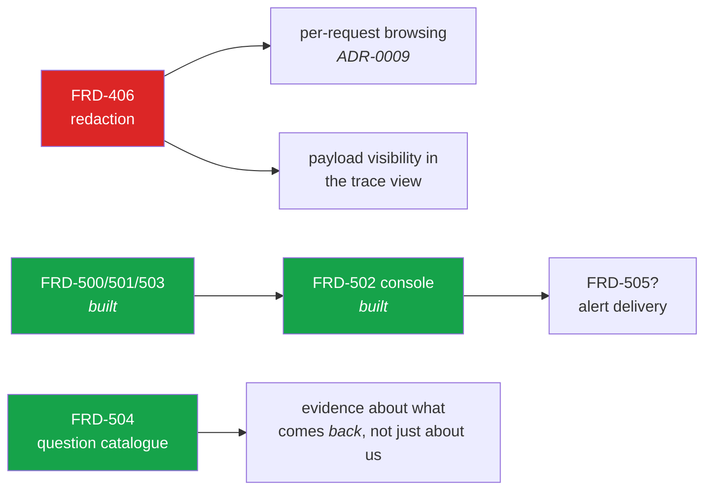

# Gap analysis — requirements against what is built

Written 2026-08-07 while documenting the system, by reading the code against
[`PRD.md`](PRD.md) §1.1 (the owner's canonical feature list), §1.2 (findings from the code review)
and the [ROADMAP](ROADMAP.md).

**Nothing here is fixed.** This is a statement of where the system stands, so that a decision to
close a gap is a decision somebody makes rather than a surprise somebody has. Items are grouped by
how much they matter, not by how hard they are.

Legend: done built and verified · partly partial, with the missing half named · missing not built

**Last re-read against the code: 2026-08-19.** That matters for a document of this kind: a gap
analysis is a *snapshot*, and one nobody re-reads becomes the opposite of what it is for — an
authoritative-looking list of things that were true a fortnight ago. Row 24 was `missing · not
scheduled` here while `FRD-118` had shipped.

---

## 1. The owner's central features (PRD §1.1)

| # | Feature | Stand | Where |
|--:|---|---|---|
| 1 | Unified provision of models | partly | Vertex (Gemini + Anthropic) done, OpenAI-compatible/self-hosted done, Foundry built but **hermetic only** — no Azure subscription has ever run it |
| 2 | Role assignment | done | `FRD-201`, `ADR-0009`, `ADR-0017`/`FRD-605` — a role is held **through a Keycloak group and nothing else**; a realm role assigned directly grants nothing |
| 3 | KIRA API compatibility | done | `FRD-107` Stage A+B — text, documents, thinking, structured output, batch embedding |
| 4 | Auditability | done | `FRD-122` — refusals recorded at the exception boundary, requested vs. served model, degradation per row |
| 5 | Storage of requests/responses: which system, when, what, with what | done | `FRD-103` + `FRD-122` — the API-key prefix distinguishes the calling system |
| 6 | Incident response | done | `FRD-503` — suspensions with author, expiry, reason; kill switch |
| 7 | Blocking dangerous requests | partly | injection filter done, operator kill switch done, and `FRD-504` can now **measure** what a model refuses — but as *controls* there are still **no further categories** (jailbreak, data exfiltration, PII in the prompt, output filtering) |
| 8 | Model routing from the definition | done | `FRD-300`, `FRD-306` |
| 9 | Model fallback | done | capability-homogeneous: a chain skips an incapable candidate rather than degrading silently |
| 10 | Independence from Google / Microsoft | partly | proven for **three** platforms by an architecture assertion — Foundry reused the OpenAI dialect unchanged and its diff never left `upstreams/`; still unproven against a real Azure subscription |
| 11 | Overview of all use cases | partly | list and detail done — **no governance view of the processing logic** across use cases (`FRD-600`) |
| 12 | Self-service filter and routing pipeline | done | `FRD-303`, `FRD-306` |
| 13 | Permitted models per use case | **done** | Two gates with two owners: a Global Administrator approves a model for the *installation* (`FRD-307`), an administrator of the use case releases it to *that* use case (`FRD-308`, 2026-08-11). Both are dispatch conditions at **every hop**, so neither `model_route` nor a fallback chain goes past them. Empty means **none**. The console picks from the catalog rather than taking free text, and the `allow_check` step — which checked only the name the caller sent, once, before routing — is gone |
| 14 | Model smoke tests and jailbreak batteries | done | `FRD-504` — one flat catalogue of 100 questions, judged by a person; a standing is the **latest run**, never a sum. Since `ADR-0020` (2026-08-16) a run is put to a **use case's own pipeline** rather than to a model, so the filter, router and redactor are what is measured and a blocked question is a result; testing a model is a use case whose pipeline starts at it. Narrower than drafted: no repetition-as-a-rate, no machine-checked expectations (the two modes are now one mechanism — a filtering pipeline or a bare one) |
| 15 | Budget overview and limits | done | `FRD-400`–`403`, `FRD-601`, `FRD-603`, `FRD-606` — a use case's consumption is shown **with or without a limit**, and so is each **person's**, with the two credentials shown apart and counted together. A per-head allowance belongs to the person rather than to the credential (`ADR-0019`, 2026-08-15): a key and a browser session share one, where they used to be two |
| 16 | Anomaly detection | done | `FRD-500`/`501` — seven kinds, evaluated against the audit trail |
| 17 | Central overview of all use cases | partly | see 11 |

**Score:** 11 built, 6 partial, 0 missing (re-counted 2026-08-09). The partials are all *breadth*
rather than correctness — each does what it says for what it covers.

> **Why this table was wrong.** Re-checked against the code on 2026-08-09 after `FRD-603`, and six
> rows understated what exists — smoke tests and Foundry were built and still recorded as missing.
> A reference table that undersells is not a harmless one: `CLAUDE.md` sends every planner here
> first, and the next person plans to build something that is already there. The rows are dated now
> so the same drift is visible rather than inferred.

---

## 2. Findings from the earlier code review (PRD §1.2)

| # | Feature | Stand |
|--:|---|---|
| 18 | Document processing (PDF, images) | done `FRD-110` — 15 media types, signature checks, a model that cannot read it is **refused by name** |
| 19 | Extensibility as a measurable property | done the assertion passes and the claim has now been tested **three** times — Vertex/Gemini, Vertex/Anthropic, and Foundry, which reused the OpenAI dialect without a line of change |
| 20 | Secrets from Vault | done `FRD-116` — a settings source, fail-closed |
| 21 | Operational diagnostics | partly `FRD-117` — build identity, upstream health, trace header, CORS done; **FR-7 (a second OpenAPI 3.0 document) not built** |
| 22 | Masking sensitive content in stored payloads | partly `FRD-406` (2026-08-08) — **credentials** are masked; PII deliberately is not |
| 23 | Report export | done `FRD-602` — CSV as a renderer on the existing endpoint |
| 24 | Multiple Keycloak backends / groups from UserInfo | **partly** `FRD-118` (2026-08-18) — several issuers, each with its own JWKS and audience set, selected by the token's issuer; **groups from UserInfo stays declined** (FR-3). The "need unclear" this row carried was answered by the owner and built. |

---

## 3. The gaps that matter, in order

### 3.1 Content redaction: the credential half is done, the PII half is a decision — `FRD-406`

**Closed on 2026-08-08 for credentials.** `PatternRedactor` masks API keys, bearer tokens, JWTs,
`Authorization:` values and PEM private key blocks in every stored request and response, plus any
pattern a deployment adds. An unusable pattern stops the gateway rather than silently matching
nothing.

**Still open, and deliberately so: personal data.** The redaction is narrow because names, customer
numbers, addresses and prose are *what the payload is stored for*. A redactor that mangles them
produces payloads nobody reads — after which the deployment switches storage off entirely, which is
strictly worse than storing them. For data that must not be persisted at all the honest control is
the per-use-case storage switch (`FRD-404`), which already exists.

So the dependency below is **partly** relieved: a stored prompt no longer leaks a credential to
anyone who can read the table. It still contains whatever business content the caller wrote, which
is why per-request browsing by non-members remains a decision rather than a build.

**What was missing.** Prompts and responses are stored (per use case, default 7 days) and **nothing
masked anything inside them**. `Redactor` was a no-op hook in place since Phase 1.

**Why it matters more than its ROADMAP position suggests.** Three things depend on it:

- The demo's `personalwesen` use case documents the absence in its own processing notes. Any real
  use case handling personal data has the same problem and probably will not write it down.
- **Per-request browsing** in the reporting screen is blocked on it ([`ADR-0009`](adr/ADR-0009-gateway-knows-roles.md)):
  showing stored prompts to people who are precisely *not* members of the use case that produced
  them is exactly what redaction exists to make safe.
- Membership had **two answers that disagreed** — the gateway read Keycloak groups, Management read
  its own rows. Closed by [`FRD-209`](features/FRD-209-access-by-group.md): a grant names a group or
  a person, and both planes resolve it from the same vocabulary.
- The **IT Security console** (`FRD-502`) would need it to show a payload; it was built to show
  **metadata only** instead, so it is not blocked — but "what was actually in that prompt" is a
  question the console still cannot answer, and the investigator has to ask the use case.

**Mitigations that exist**: a retention period, and switching payload storage off entirely. Neither
masks anything in a payload that *is* kept.

**Was deferred by decision** (2026-08-05); the credential half landed 2026-08-08 with `ADR-0015`.

---

### 3.2 ~~The IT Security console does not exist~~ — closed by `FRD-502` (2026-08-08)

Phase 5 built the rules, the engine and the enforcement, and the screen was missing — the shape of
the defect [`FRD-206`](features/FRD-206-console-truthfulness.md) fixed: a role whose console shows
it nothing. Now built:

| API | Screen |
|---|---|
| `GET /v1beta/anomalies` | **Security → Findings**, and **Warnings** per use case |
| `GET/POST/DELETE /v1beta/suspensions` | **Security → Suspensions**, with the kill switch |
| global anomaly rules (`/api/v1/anomaly-rules/`) | **Security → Rules** |
| `GET /v1beta/traces` *(new)* | **Traces** per use case |

All three refresh themselves; the reader can switch that off and sees how stale the view is.

**What is still open here**: alert *delivery* (mail, webhook) is not built — the console is where a
finding is seen, not where it is sent. Trace search **was** open and is not any more (2026-08-08):
the list filters by outcome, refusals, API key prefix, subject, source address, "only my requests"
and "only tool calls" — the address one served, and offered, only to a role that may act on an
incident. Traces carry **metadata only**, which is a deliberate scope line rather than a gap — see
3.1 — and now include the **tool calls** a request made: names and a count, never arguments.

---

### 3.3 Feature 7 is narrower than it reads

"Blocking dangerous requests" is implemented as **one** heuristic-or-LLM prompt-injection filter,
plus the operator kill switch. Not implemented: jailbreak categories beyond injection, data
exfiltration patterns, PII detection in the prompt, or output filtering of any kind.

The pipeline also has a **stated blind spot**: `CanonicalMessage.text` is lossy since documents
arrived, so a prompt injection **inside a PDF is invisible to the injection filter**
([`FRD-110`](features/FRD-110-multimodal-content.md)). This is written down, not fixed.

And measured honestly: against a 0.6B local model the LLM filter answers `INJECTION` to everything.
The filter is exactly as good as the model behind it.

---

### 3.4 Microsoft Foundry has never met Azure — `FRD-120`

The transport, the routing axis and the dialect are built and hermetically tested. **No Azure
subscription has ever been called.** Everything the earlier live rounds found — a model name with a
colon, usage in an empty `choices` array, missing stream usage — was found by running against a real
endpoint, and none of those classes of defect can be ruled out here.

Feature 10 ("independence from Google/Microsoft") is therefore proven for **two** providers, not
three.

---

### 3.5 The question catalogue — `FRD-504`

**Built**; this section is kept because the gap it named is a good statement of why. AIRA has
extensive evidence about **itself** — every request measured, priced, bounded — and had none about
what comes *back*. Both halves of that are now measurable and by one mechanism: the catalogue is put
to a use case's pipeline, so running it against a filtering pipeline measures the filter and running
it against a bare one measures the model (`ADR-0020`). What remains open is not the mechanism but
§5.2 of the FRD — a case runs **once**, so the result is an anecdote where the specification asked
for a rate over repeated attempts, and a model that refuses nine times in ten still reads as a
refusal.

---

### 3.6 Nothing is paginated

No list endpoint or screen paginates: use cases, keys, budgets, limits, rules, anomaly events,
suspensions. A live round produced 801 leftover use cases and the list became unusable — which was
cleaned up rather than fixed. An installation with a few hundred use cases will hit this on the
first screen.

---

### 3.7 A breach is a 429 and nothing else

Budget threshold alerting is not built. Today a use case learns it is over budget when its traffic
starts failing. There is no "80 % of your monthly budget" anywhere — no mail, no webhook, no banner.

The same is true of anomaly findings: an event is a row, and `FRD-503` §7 says explicitly that
**who gets told** is a separate decision with its own blast radius, not yet made.

---

### 3.8 Membership can drift between the two sources

Control-plane membership lives in Management; data-plane membership lives in Keycloak groups. They
are set independently and **nothing detects a divergence**. The console now explains the difference
where a reader would otherwise be confused, but explaining a drift is not the same as noticing one.

A live round found real instances of exactly this: two roles carrying stale memberships from
declarations that no longer existed.

---

## 4. Smaller, known, and written down

| Gap | Note |
|---|---|
| `FRD-117` FR-7 — a second OpenAPI 3.0 document | Not built, stated rather than implied |
| `FRD-307` — approved model catalog with pickers | **done** (2026-08-09), with the per-use-case release in `FRD-308` (2026-08-11) |
| `FRD-600` — governance view of processing logic | Reporting exists; the read-only "what does each use case do" view does not |
| `FRD-118` — multiple identity backends | Need unclear; not scheduled |
| `FRD-121` — document conversion for models that cannot read a type | Deliberately not built: the recommendation is to refuse rather than convert |
| `FRD-106` — an OpenAI-compatible **surface** | **Withdrawn** 2026-08-07. The OpenAI *dialect* as an upstream is unaffected and is built |
| Local model prices | Invented, and they say so in their display name |
| No Git remote | Every commit is local; `.github/workflows/ci.yml` has therefore **never run** — only `make ci` locally |

---

## 5. What is *not* a gap, though it might look like one

Recorded so the same questions are not re-asked:

- **No agent features.** No retrieval, no vector storage, no conversation state, no tool execution,
  no workflow orchestration. This is [`ADR-0013`](adr/ADR-0013-auditable-model-access-not-agents.md),
  a decision rather than an omission. The test for any request: *does this make model access better
  governed and better evidenced, or does it make the gateway think for the use case?*
- **No OpenAI-compatible surface.** Withdrawn by the owner.
- **Whole-row retention defaults to never.** Deliberate: deleting rows would truncate the spend
  history that cost reporting is made of.
- **`alert` is the default for a new anomaly rule.** A safety property, not timidity.
- **Kafka is not on the incident path.** The kill switch writes straight to the gateway, because a
  control that depends on the event bus fails exactly when the bus is the problem.
- **Rotation is a restart.** Vault values are read at startup; recorded as a decision.

---

## 6. If somebody asked "what would you do next"

Not a plan — the owner sets priority — but the dependencies are worth stating, because two of them
are not obvious:

`FRD-406` is the only item that unblocks two others, and it is the only one where the product
currently makes a promise it does not keep. `FRD-502` **is now built** — it turned work already
done into work somebody can use. Everything else is breadth.
