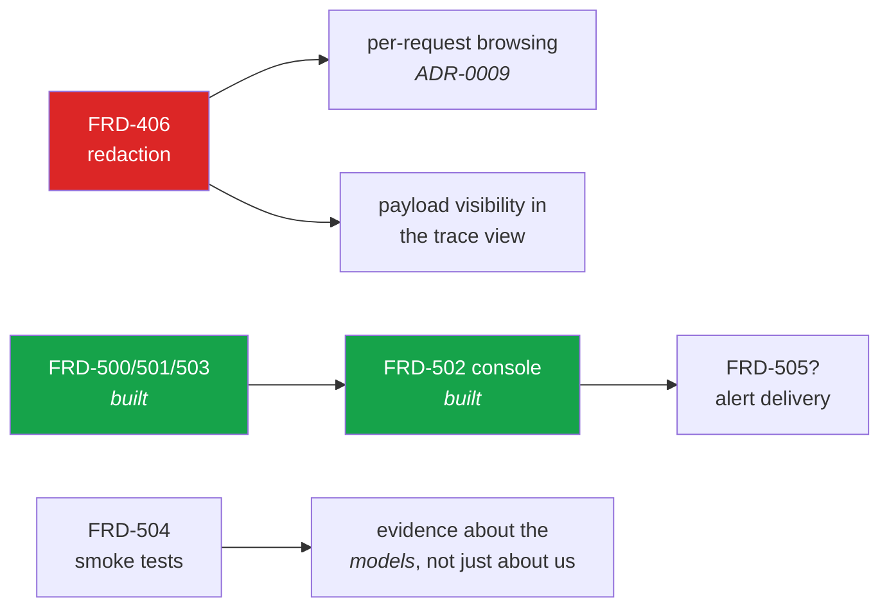

# Gap analysis — requirements against what is built

Written 2026-08-07 while documenting the system, by reading the code against
[`PRD.md`](PRD.md) §1.1 (the owner's canonical feature list), §1.2 (findings from the code review)
and the [ROADMAP](ROADMAP.md).

**Nothing here is fixed.** This is a statement of where the system stands, so that a decision to
close a gap is a decision somebody makes rather than a surprise somebody has. Items are grouped by
how much they matter, not by how hard they are.

Legend: ✅ built and verified · 🟡 partial, with the missing half named · ❌ not built

---

## 1. The owner's central features (PRD §1.1)

| # | Feature | Stand | Where |
|--:|---|---|---|
| 1 | Unified provision of models | 🟡 | Vertex (Gemini + Anthropic) ✅, OpenAI-compatible/self-hosted ✅, Foundry **hermetic only** — no Azure subscription has ever run it |
| 2 | Role assignment | ✅ | `FRD-201`, `ADR-0009` |
| 3 | KIRA API compatibility | ✅ | `FRD-107` Stage A+B — text, documents, thinking, structured output, batch embedding |
| 4 | Auditability | ✅ | `FRD-122` — refusals recorded at the exception boundary, requested vs. served model, degradation per row |
| 5 | Storage of requests/responses: which system, when, what, with what | ✅ | `FRD-103` + `FRD-122` — the API-key prefix distinguishes the calling system |
| 6 | Incident response | ✅ | `FRD-503` — suspensions with author, expiry, reason; kill switch |
| 7 | Blocking dangerous requests | 🟡 | injection filter ✅, operator kill switch ✅ — **no further categories** (jailbreak, data exfiltration, PII in the prompt) |
| 8 | Model routing from the definition | ✅ | `FRD-300`, `FRD-306` |
| 9 | Model fallback | ✅ | capability-homogeneous: a chain skips an incapable candidate rather than degrading silently |
| 10 | Independence from Google / Microsoft | 🟡 | proven for **two** providers by an architecture assertion; Foundry unproven against a real subscription |
| 11 | Overview of all use cases | 🟡 | list and detail ✅ — **no governance view of the processing logic** across use cases (`FRD-600`) |
| 12 | Self-service filter and routing pipeline | ✅ | `FRD-303`, `FRD-306` |
| 13 | Permitted models per use case | 🟡 | allow-list ✅, capabilities enforced ✅ — **no approved catalog with pickers** (`FRD-307`) |
| 14 | Model smoke tests and jailbreak batteries | ❌ | `FRD-504` written, **not built** |
| 15 | Budget overview and limits | ✅ | `FRD-400`–`403`, `FRD-601` |
| 16 | Anomaly detection | ✅ | `FRD-500`/`501` — seven kinds, evaluated against the audit trail |
| 17 | Central overview of all use cases | 🟡 | see 11 |

**Score:** 9 built, 6 partial, 2 missing. The partials are all *breadth* rather than correctness —
each does what it says for what it covers.

---

## 2. Findings from the earlier code review (PRD §1.2)

| # | Feature | Stand |
|--:|---|---|
| 18 | Document processing (PDF, images) | ✅ `FRD-110` — 15 media types, signature checks, a model that cannot read it is **refused by name** |
| 19 | Extensibility as a measurable property | 🟡 architecture assertion passes; the claim "a new family is a catalog entry plus at most one dialect" has been tested twice, not three times |
| 20 | Secrets from Vault | ✅ `FRD-116` — a settings source, fail-closed |
| 21 | Operational diagnostics | 🟡 `FRD-117` — build identity, upstream health, trace header, CORS ✅; **FR-7 (a second OpenAPI 3.0 document) not built** |
| 22 | Masking sensitive content in stored payloads | ❌ `FRD-406` — the `Redactor` is still a `NoOpRedactor` |
| 23 | Report export | ✅ `FRD-602` — CSV as a renderer on the existing endpoint |
| 24 | Multiple Keycloak backends / groups from UserInfo | ❌ `FRD-118` — **need unclear**, not scheduled |

---

## 3. The gaps that matter, in order

### 3.1 Content redaction is a promise the product does not keep — `FRD-406`

**What is missing.** Prompts and responses are stored (per use case, default 7 days) and **nothing
masks anything inside them**. `Redactor` is a no-op hook that has been in place since Phase 1.

**Why it matters more than its ROADMAP position suggests.** Three things depend on it:

- The demo's `personalwesen` use case documents the absence in its own processing notes. Any real
  use case handling personal data has the same problem and probably will not write it down.
- **Per-request browsing** in the reporting screen is blocked on it ([`ADR-0009`](adr/ADR-0009-gateway-knows-roles.md)):
  showing stored prompts to people who are precisely *not* members of the use case that produced
  them is exactly what redaction exists to make safe.
- The **IT Security console** (`FRD-502`) would need it to show a payload; it was built to show
  **metadata only** instead, so it is not blocked — but "what was actually in that prompt" is a
  question the console still cannot answer, and the investigator has to ask the use case.

**Mitigations that exist**: a retention period, and switching payload storage off entirely. Neither
masks anything in a payload that *is* kept.

**Deferred by decision** (2026-08-05), and that decision is now load-bearing for two other features.

---

### 3.2 ~~The IT Security console does not exist~~ — closed by `FRD-502` (2026-08-08)

Phase 5 built the rules, the engine and the enforcement, and the screen was missing — the shape of
the defect [`FRD-206`](features/FRD-206-console-truthfulness.md) fixed: a role whose console shows
it nothing. Now built:

| API | Screen |
|---|---|
| `GET /v1beta/anomalies` | **Security → Findings**, and **Warnings** per use case |
| `GET/POST/DELETE /v1beta/suspensions` | **Security → Suspensions**, with the kill switch |
| global anomaly rules (`/api/v1/anomaly-rules/`) | **Security → Rules** |
| `GET /v1beta/traces` *(new)* | **Traces** per use case |

All three refresh themselves; the reader can switch that off and sees how stale the view is.

**What is still open here**: alert *delivery* (mail, webhook) is not built — the console is where a
finding is seen, not where it is sent; and trace search by subject or credential is not built (the
filters are outcome and window). Traces carry **metadata only**, which is a deliberate scope line
rather than a gap — see 3.1.

---

### 3.3 Feature 7 is narrower than it reads

"Blocking dangerous requests" is implemented as **one** heuristic-or-LLM prompt-injection filter,
plus the operator kill switch. Not implemented: jailbreak categories beyond injection, data
exfiltration patterns, PII detection in the prompt, or output filtering of any kind.

The pipeline also has a **stated blind spot**: `CanonicalMessage.text` is lossy since documents
arrived, so a prompt injection **inside a PDF is invisible to the injection filter**
([`FRD-110`](features/FRD-110-multimodal-content.md)). This is written down, not fixed.

And measured honestly: against a 0.6B local model the LLM filter answers `INJECTION` to everything.
The filter is exactly as good as the model behind it.

---

### 3.4 Microsoft Foundry has never met Azure — `FRD-120`

The transport, the routing axis and the dialect are built and hermetically tested. **No Azure
subscription has ever been called.** Everything the earlier live rounds found — a model name with a
colon, usage in an empty `choices` array, missing stream usage — was found by running against a real
endpoint, and none of those classes of defect can be ruled out here.

Feature 10 ("independence from Google/Microsoft") is therefore proven for **two** providers, not
three.

---

### 3.5 Model smoke tests — `FRD-504`

Written and not built. The gap it names: AIRA has extensive evidence about **itself** — every
request measured, priced, bounded — and **none about the models it serves**. Whether a given model
resists a jailbreak, and whether the pipeline catches what the model would not, is currently
nobody's measurement.

---

### 3.6 Nothing is paginated

No list endpoint or screen paginates: use cases, keys, budgets, limits, rules, anomaly events,
suspensions. A live round produced 801 leftover use cases and the list became unusable — which was
cleaned up rather than fixed. An installation with a few hundred use cases will hit this on the
first screen.

---

### 3.7 A breach is a 429 and nothing else

Budget threshold alerting is not built. Today a use case learns it is over budget when its traffic
starts failing. There is no "80 % of your monthly budget" anywhere — no mail, no webhook, no banner.

The same is true of anomaly findings: an event is a row, and `FRD-503` §7 says explicitly that
**who gets told** is a separate decision with its own blast radius, not yet made.

---

### 3.8 Membership can drift between the two sources

Control-plane membership lives in Management; data-plane membership lives in Keycloak groups. They
are set independently and **nothing detects a divergence**. The console now explains the difference
where a reader would otherwise be confused, but explaining a drift is not the same as noticing one.

A live round found real instances of exactly this: two roles carrying stale memberships from
declarations that no longer existed.

---

## 4. Smaller, known, and written down

| Gap | Note |
|---|---|
| `FRD-117` FR-7 — a second OpenAPI 3.0 document | Not built, stated rather than implied |
| `FRD-307` — approved model catalog with pickers | The *price* half is built; the approval half is not |
| `FRD-600` — governance view of processing logic | Reporting exists; the read-only "what does each use case do" view does not |
| `FRD-118` — multiple identity backends | Need unclear; not scheduled |
| `FRD-121` — document conversion for models that cannot read a type | Deliberately not built: the recommendation is to refuse rather than convert |
| `FRD-106` — an OpenAI-compatible **surface** | **Withdrawn** 2026-08-07. The OpenAI *dialect* as an upstream is unaffected and is built |
| Local model prices | Invented, and they say so in their display name |
| No Git remote | Every commit is local; `.github/workflows/ci.yml` has therefore **never run** — only `make ci` locally |

---

## 5. What is *not* a gap, though it might look like one

Recorded so the same questions are not re-asked:

- **No agent features.** No retrieval, no vector storage, no conversation state, no tool execution,
  no workflow orchestration. This is [`ADR-0013`](adr/ADR-0013-auditable-model-access-not-agents.md),
  a decision rather than an omission. The test for any request: *does this make model access better
  governed and better evidenced, or does it make the gateway think for the use case?*
- **No OpenAI-compatible surface.** Withdrawn by the owner.
- **Whole-row retention defaults to never.** Deliberate: deleting rows would truncate the spend
  history that cost reporting is made of.
- **`alert` is the default for a new anomaly rule.** A safety property, not timidity.
- **Kafka is not on the incident path.** The kill switch writes straight to the gateway, because a
  control that depends on the event bus fails exactly when the bus is the problem.
- **Rotation is a restart.** Vault values are read at startup; recorded as a decision.

---

## 6. If somebody asked "what would you do next"

Not a plan — the owner sets priority — but the dependencies are worth stating, because two of them
are not obvious:

`FRD-406` is the only item that unblocks two others, and it is the only one where the product
currently makes a promise it does not keep. `FRD-502` **is now built** — it turned work already
done into work somebody can use. Everything else is breadth.
