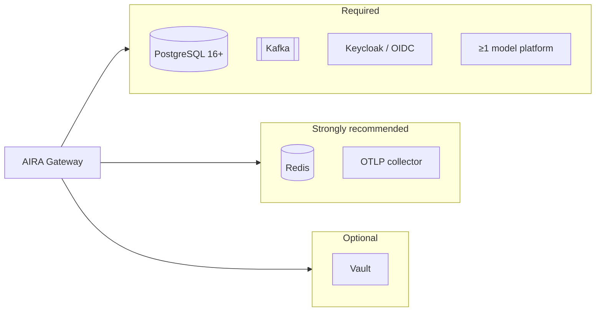
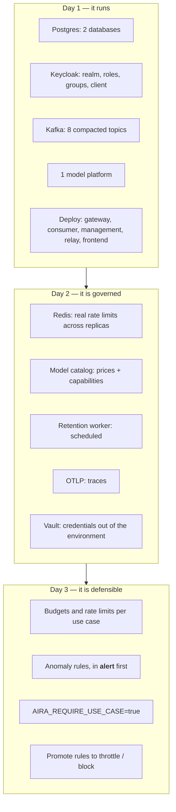

# Integrating with your infrastructure

What each connected system must provide, which credentials AIRA needs, and which settings on **your**
side matter. One section per system; each ends with a short checklist.

Configuration values are named here and defined in [`CONFIGURATION.md`](CONFIGURATION.md). How to
run the processes is [`SETUP.md`](SETUP.md).



---

## 1. PostgreSQL

**Two databases**, one per plane. They are not interchangeable.

| Database | Owner | Holds |
|---|---|---|
| `aira_mgmt` | Management | configuration: use cases, memberships, hashed API keys, pipelines, budgets, limits, rules, model catalog, outbox |
| `aira_gateway` | Gateway | read-model of the above, plus `request_logs`, `anomaly_events`, `access_suspensions`, `budget_usage` |

**What you provide**

- PostgreSQL **16 or newer** (the code uses `JSONB`, partial indexes and `now()` server defaults).
- One role with `CREATE` on both databases — migrations create and alter tables.
- No extensions beyond the defaults.

**Sizing.** `request_logs` is the one table that grows with traffic: one row per request, plus one
per pipeline model call. Payloads (`request_payload`, `response_payload`) dominate its size and are
deleted on the retention clock; the metadata is kept, because that is what the spend history is made
of. If you set `AIRA_LOG_RETENTION_DAYS`, you are also truncating the reporting horizon — the
default of `0` (never) is deliberate.

**Migrations** are Alembic (gateway) and Django (Management), run as one-shot jobs **before** the
new code starts. Nothing else may create tables: an old container's `create_all` once resurrected a
dropped table and then failed every event against it.

> ✅ two databases · a role that may migrate · migrations as a pre-deploy job · a plan for
> `request_logs` growth

---

## 2. Keycloak (or another OIDC provider)

AIRA needs **one realm** with five roles, one group hierarchy, and two clients.

### Realm roles

| Role | Means |
|---|---|
| `global-admin` | everything; the only role that may price a model |
| `it-steuerung` | sees every use case and every figure; **writes nothing** |
| `it-security` | sees every use case's configuration; may author global anomaly rules and stop traffic |
| `use-case-admin` | administers the use cases they are a member of |
| `use-case-user` | uses the use cases they are a member of |

Realm roles are the **source of truth**. On authentication they are synced onto Django groups;
removing a role in Keycloak removes it in AIRA on the next login.

### Groups — data-plane membership

```
/use-cases/<slug>
```

A user in `/use-cases/kundenservice` may call the gateway attributed to that use case. This is a
**different list** from the member list in the console: Management's membership grants
*control-plane* rights (object permissions), the Keycloak group grants *data-plane* access. Being in
one does not put you in the other, and the console says so where it matters.

### Clients

| Client | Type | Used by | Needs |
|---|---|---|---|
| `aira-gateway` | public, **PKCE S256** | the SPA and the gateway's JWKS validation | exact redirect URIs and web origins — never `*` |
| *(service accounts)* | confidential | machine-to-machine callers | `client_credentials`, realm roles as needed |

**Settings on your side that matter**

- **Direct access grants (password grant): off.** AIRA does not use it, and enabling it weakens the
  realm for a convenience a machine-to-machine grant already provides.
- **Redirect URIs and web origins: pinned** to your SPA origin. A wildcard lets an attacker redirect
  the authorization code to a site they control.
- **Do not request `offline_access`.** The code flow already returns a refresh token;
  `offline_access` asks for one that outlives the SSO session, which a governance console must not
  hold — and if the realm forbids offline tokens, the code-to-token exchange fails with an error
  Keycloak returns *without* CORS headers, so the browser reports something that names neither the
  scope nor the setting.
- **Client description length**: Keycloak stores it in `varchar(255)`. A longer one breaks the
  realm import, and the failure looks like Keycloak not starting.

> ✅ five realm roles · `/use-cases/<slug>` groups · a public PKCE client with pinned URIs · password
> grant off · issuer reachable from both services

---

## 3. Apache Kafka

Configuration flows Management → Kafka → gateway. **Eight compacted topics**, one per entity kind:

| Topic | Carries |
|---|---|
| `aira.usecases` | use cases |
| `aira.memberships` | control-plane memberships |
| `aira.api-keys` | key hashes and revocations |
| `aira.pipelines` | pipeline configuration |
| `aira.budgets` | budgets |
| `aira.rate-limits` | rate limits |
| `aira.models` | the model catalog, prices and capabilities |
| `aira.anomaly-rules` | anomaly rules |

**What you provide**

- `cleanup.policy=compact` on each. Compaction is what makes the read-model rebuildable: the latest
  value per key is the state.
- **Create them explicitly.** If auto-creation is off — as it should be — a missing topic fails
  **silently**: Management accepts the change, the relay publishes, the broker drops it, and no
  error reaches anybody. The only trace is a line in a consumer log. This has happened twice here,
  which is why `make kafka-topics` is idempotent and a test keeps the list in step with the code.
- Retention: compaction handles it; no time-based retention is needed.
- One partition per topic is sufficient. Ordering per key is what matters, and volume is
  configuration changes rather than traffic.

**Single-writer processes.** Run exactly **one** relay and **one** consumer. They are not
horizontally scalable and do not need to be.

> ✅ eight compacted topics, created explicitly · one relay · one consumer · bootstrap servers
> reachable from both planes

---

## 4. Redis

Optional to start, **required to scale**. It holds rate-limit buckets and budget reservations —
values written on *every* request, which is what earns it a place.

Without it, rate limits become **per-instance**: N replicas behind a load balancer allow N × the
limit. Budgets fall back to the Postgres path, which enforces but is racy.
`/readyz` reports `degraded: true` and keeps serving.

**What you provide**: any Redis 6+ reachable at `AIRA_REDIS_URL`. No persistence is required —
counters seed from Postgres on a miss and expire in five minutes so drift cannot outlive a period.

> ✅ one Redis, or accept per-instance limits and one gateway replica

---

## 5. Model platforms

At least one. Each is registered **only when configured**, and each is audited under its own
provider, publisher and region.

### Google Vertex AI — Gemini and Anthropic, EU-regional

| You provide | Why |
|---|---|
| A GCP **project** with Vertex AI enabled | |
| A **service account** with `roles/aiplatform.user` | The narrowest role that can call `:generateContent` and `:rawPredict` |
| Its **JSON key**, in Vault or a mounted file | `AIRA_VERTEX_CREDENTIALS` |
| The **regions** you are permitted to use | Listed in `AIRA_ALLOWED_REGIONS`; a model outside them refuses to start |
| **Model Garden access** for the publishers you want | Anthropic models need to be enabled in your project |

One transport, two dialects. Anthropic on Vertex uses `:rawPredict` with the Messages API:
`max_tokens` is always sent, thinking blocks are **dropped and never persisted**, cache tokens count
as input, and there are no embeddings.

### Microsoft Foundry / Azure OpenAI

| You provide | Why |
|---|---|
| An **Azure OpenAI resource** endpoint | `AIRA_FOUNDRY_ENDPOINT` |
| An **API key** or Entra credentials | The Entra token is minted per request, not captured once |
| One **deployment per model**, with its region | `AIRA_FOUNDRY_DEPLOYMENTS` as `model=deployment@region` |

An Azure **deployment name is not a model name**. Attributing a response to the deployment would not
fail — the spend figure would quietly stop being complete, because a deployment has no price. AIRA
keeps both and prices the underlying model.

### Self-hosted, OpenAI-compatible (Ollama, vLLM, …)

| You provide | Why |
|---|---|
| One or more **named servers** | `AIRA_OPENAI_SERVERS` as `name=url\|models\|embeddings\|region`; a fleet is several machines and each is audited by name |
| A **region label**, if the deployment claims one | Checked at startup against the residency policy |

Two traps this dialect hides, both handled: usage arrives in a chunk with an **empty `choices`
array**, and the vendor reports **no stream usage** unless `stream_options.include_usage` is sent —
a stream reporting none would be released rather than settled, and every streamed request would be
silently free.

### Google Gemini public API

An API key (`AIRA_GOOGLE_API_KEY`). Simplest to start with, and the one to avoid where residency
matters.

> ✅ credentials in Vault or a mounted secret · regions on the allow-list · every model that will be
> served declared in the catalog with a **price** and its **capabilities**

---

## 6. Observability

OTLP over HTTP to any collector. Traces carry `aira.*` attributes — subject, use case, model,
outcome, tokens, cost, provider/publisher/region — so a trace can be filtered by any of them.

`?key=` is redacted from spans; credentials never appear in a log line. `x-trace-id` is on **every**
response including failures, which are the ones most worth correlating.

> ✅ an OTLP endpoint · `AIRA_OTEL_ENABLED=true` · a sample ratio you can afford

---

## 7. The SPA is configured at build time

The Angular bundle contains its OIDC issuer and client id. There is no run-time configuration file,
so **deploying the SPA means building it** for your realm:

```bash
# management/frontend/src/environments/  (or the equivalent in your pipeline)
issuer:   https://sso.example.com/realms/aira
clientId: aira-gateway
```

At run time nginx needs the two proxy targets:

| Path | Goes to |
|---|---|
| `/api` | Management |
| `/gw` | Gateway |

Its resolver must **re-resolve** upstreams. With a name resolved once at start-up, a gateway
container restarting behind a new IP produces a 502 that outlives the restart.

The bundle sets a CSP and uses `requireHttps: 'remoteOnly'`, so it works on `localhost` over HTTP
and demands HTTPS everywhere else.

> ✅ build per environment · both proxies · a resolver that re-resolves · TLS in front

---

## 8. Reverse proxy and TLS

Terminate TLS in front of both APIs. Two things AIRA needs from the proxy:

- **`X-Forwarded-For`**, if you want real client addresses in the audit trail — and then set
  `AIRA_TRUST_FORWARDED_FOR=true`. Leave it off otherwise: with it on and no trusted proxy, any
  caller can write any address into your audit trail.
- **No buffering on streaming responses.** `:streamGenerateContent` is SSE; a proxy that buffers it
  turns a stream into a single late response.

Timeouts should exceed your slowest model. A self-deployed model cold-starting can take minutes,
which is why its own timeout defaults to 300 seconds.

> ✅ TLS · `X-Forwarded-For` matched by the setting · SSE unbuffered · generous timeouts

---

## 9. What a first integrated deployment looks like



The order is not arbitrary. **Prices before budgets** — an unpriced model makes a cost budget
unenforceable, and unpriced traffic is counted apart rather than as zero. **Alert before block** —
a rule is a hypothesis until somebody has watched it be right, and a detection system that blocks
wrongly once is switched off forever. **`REQUIRE_USE_CASE` last** — turning it on before every
caller is migrated refuses traffic that used to work.
