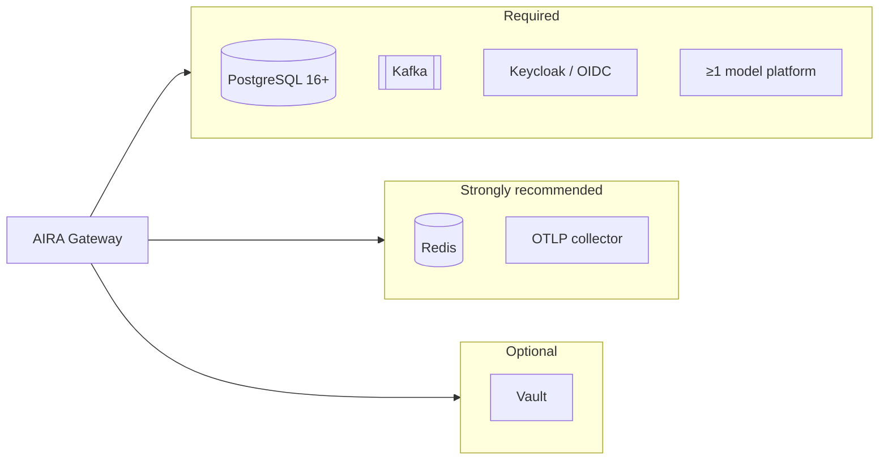
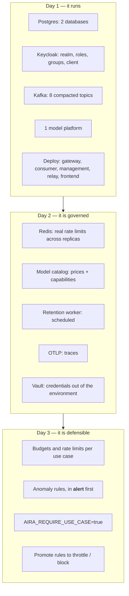

# Integrating with your infrastructure

What each connected system must provide, which credentials AIRA needs, and which settings on **your**
side matter. One section per system; each ends with a short checklist.

Configuration values are named here and defined in [`CONFIGURATION.md`](CONFIGURATION.md). How to
run the processes is [`SETUP.md`](SETUP.md).



---

## 1. PostgreSQL

**Two databases**, one per plane. They are not interchangeable.

| Database | Owner | Holds |
|---|---|---|
| `aira_mgmt` | Management | configuration: use cases, memberships, hashed API keys, pipelines, budgets, limits, rules, model catalog, outbox |
| `aira_gateway` | Gateway | read-model of the above, plus `request_logs`, `anomaly_events`, `access_suspensions`, `budget_usage` |

**What you provide**

- PostgreSQL **16 or newer** (the code uses `JSONB`, partial indexes and `now()` server defaults).
- One role with `CREATE` on both databases — migrations create and alter tables.
- No extensions beyond the defaults.

**Sizing.** `request_logs` is the one table that grows with traffic: one row per request, plus one
per pipeline model call. Payloads (`request_payload`, `response_payload`) dominate its size and are
deleted on the retention clock; the metadata is kept, because that is what the spend history is made
of. If you set `AIRA_LOG_RETENTION_DAYS`, you are also truncating the reporting horizon — the
default of `0` (never) is deliberate.

**Migrations** are Alembic (gateway) and Django (Management), run as one-shot jobs **before** the
new code starts. Nothing else may create tables: an old container's `create_all` once resurrected a
dropped table and then failed every event against it.

> done two databases · a role that may migrate · migrations as a pre-deploy job · a plan for
> `request_logs` growth

---

## 2. Keycloak (or another OIDC provider)

AIRA needs **one realm**, three role groups, whatever groups your organisation already uses, and
two clients.

### Roles come from groups (`ADR-0017`)

**Group membership is the only source of a role.** Three groups carry the organisation-wide roles,
and you tell AIRA which is which:

```
AIRA_ROLE_GROUPS=global-admin=/aira/global-admins;it-security=/aira/it-security;it-steuerung=/aira/it-steuerung
```

| Role | Means |
|---|---|
| `global-admin` | everything; the only role that may create a use case or price a model |
| `it-steuerung` | sees every use case and every figure; **writes nothing** |
| `it-security` | sees every use case's configuration; may author global anomaly rules and stop traffic |

The paths are yours — `/it/security-team` is as good as `/aira/it-security`, and several groups may
confer one role (`it-security=/a/one,/b/two`). The match is **exact**: a sub-group does not inherit,
and `/aira/global-admins-readonly` confers nothing.

> **A Keycloak realm role grants nothing.** AIRA does not read `realm_access.roles`. Assigning
> `global-admin` directly to a person has no effect — which is the point: there is exactly one place
> a role is granted, so there is exactly one place to audit and one place to revoke.

Outside `local`, Management **refuses to start** when no group is named for `global-admin`: an
installation nobody can administer cannot be repaired through its own console.

**There is no `use-case-admin` or `use-case-user` role.** Administering or belonging to a use case
is a grant on *that* use case — a Global Administrator creates it and names the group that
administers it; administrators name the groups that are its members. See the next section.

### Groups — who reaches which use case

**Your group names are yours.** A use case's access list names whatever paths your realm actually
uses — `/abteilungen/vertrieb/nord`, `/ai/kundenservice` — and AIRA grants them a role
(`user` or `admin`) in the console. Somebody joining or leaving the group takes effect on their
next token, without anybody editing a list here. See
[`FRD-209`](features/FRD-209-access-by-group.md).

A naming convention also still works, and needs no configuration at all:

```
/use-cases/<slug>
```

A user in `/use-cases/kundenservice` reaches that use case by the name alone. It is one route of
**three**, and they are a **union** — where the roles differ, the stronger wins:

1. this convention, resolvable from the token by itself;
2. a grant to **any group path your realm already uses** — `/abteilungen/vertrieb/nord`, whatever
   it is. AIRA imposes no naming convention on somebody else's directory;
3. a grant naming **one person**, for the case where no group fits.

You do not need a group per use case. Route 1 exists because it needs no configuration at all and
is a perfectly good way to run a small installation.

**AIRA never writes to your directory.** It does not create groups, add people to them or delete
them. Group membership stays your system's answer.

#### The one setting this depends on

> **The access token must carry a `groups` claim, with full paths.**

Without it a group grant reaches nobody — silently, because a token with no groups is
indistinguishable from a token whose owner is in none. Add a **group-membership** protocol mapper
to every client whose tokens AIRA sees, including service accounts:

| Field | Value |
|---|---|
| Mapper type | Group Membership |
| Token Claim Name | `groups` |
| Full group path | **on** |
| Add to access token | on |

The dev realm has it on the SPA client and on the test service accounts. A realm that has it on
only some of them produces a feature that works for some callers and not others, which is the
hardest shape of all to diagnose.

#### And one that decides whose allowance is whose

> **`preferred_username` should be in the access token** — Keycloak puts it there by default.

A per-head budget or rate limit is counted against the **person**, so that an API key and a browser
session by the same human share one allowance rather than getting two
([`ADR-0019`](adr/ADR-0019-an-allowance-belongs-to-a-person.md)). The name in the token is what
joins them: an API key's identity already *is* its owner's username, and a token's subject is a
directory id that resembles nothing.

Without the claim nothing breaks and nothing is silently shared: that caller's allowance keys on
their subject, which is stable and unique — they simply get a second one for their key. A service
account, which has no person behind it, is exactly this case and is right to be.

#### The username has to be one Keycloak does not let people change

> **Leave *Edit username* off in the realm** (Realm settings → Login). It is off by default.

This is the one assumption AIRA makes about your directory that it cannot check for you, so it is
written down rather than left implied. The name in the token is not only a label:

| What it decides | Where |
| --- | --- |
| which use cases a caller reaches, where a grant names a **person** rather than a group | `FRD-209` §2.1 |
| whose per-head budget and rate limit the request counts against | [`ADR-0019`](adr/ADR-0019-an-allowance-belongs-to-a-person.md) |
| whether the payload view treats somebody as an administrator of their use case | `FRD-505` |
| which Django account a new `sub` binds to on first sign-in | `ADR-0007` |

With *Edit username* on, a user can rename themselves to a colleague's name and inherit each of
those. Everything else AIRA reads from a token — the subject, the groups — is Keycloak's to set and
nobody else's, and the username is the exception because a realm can be configured to hand it to
the user.

AIRA does not check the setting: reading it needs the optional admin client below, so a check
would pass silently on every installation that has not configured one — a control that is present
on paper and absent in practice, which this project refuses to ship. If your realm must allow
username editing, grant access by **group** only and expect one person's allowances to follow the
name rather than the human.

#### Searching your directory (optional)

To let the console **search** your groups and users when granting access, give AIRA a read-only
service account and set `AIRA_DIRECTORY_CLIENT_ID` / `AIRA_DIRECTORY_CLIENT_SECRET`. It needs
`view-users` and `query-groups` on the realm — nothing else, and it is never used for anything but
a search.

Without it the console still works: it offers the people who have signed in and the groups already
granted somewhere, and **says that is what it is showing**. It cannot invent a group nobody has
used, so on a fresh installation the first grant of a new group has to be typed.

### Clients

| Client | Type | Used by | Needs |
|---|---|---|---|
| `aira-gateway` | public, **PKCE S256** | the SPA and the gateway's JWKS validation | exact redirect URIs and web origins — never `*` |
| *(service accounts)* | confidential | machine-to-machine callers | `client_credentials`, realm roles as needed |

**Settings on your side that matter**

- **Direct access grants (password grant): off.** AIRA does not use it, and enabling it weakens the
  realm for a convenience a machine-to-machine grant already provides.
- **Redirect URIs and web origins: pinned** to your SPA origin. A wildcard lets an attacker redirect
  the authorization code to a site they control.
- **Do not request `offline_access`.** The code flow already returns a refresh token;
  `offline_access` asks for one that outlives the SSO session, which a governance console must not
  hold — and if the realm forbids offline tokens, the code-to-token exchange fails with an error
  Keycloak returns *without* CORS headers, so the browser reports something that names neither the
  scope nor the setting.
- **Client description length**: Keycloak stores it in `varchar(255)`. A longer one breaks the
  realm import, and the failure looks like Keycloak not starting.

> done three role groups named in `AIRA_ROLE_GROUPS` · a **`groups` claim with full paths on
> every client, including service accounts** — without it nobody holds any role at all · a public
> PKCE client
> with pinned URIs · password grant off · issuer reachable from both services · *(optional)* a
> read-only service account for directory search

---

## 3. Apache Kafka

Configuration flows Management → Kafka → gateway. **Eight compacted topics**, one per entity kind:

| Topic | Carries |
|---|---|
| `aira.usecases` | use cases |
| `aira.memberships` | control-plane memberships |
| `aira.api-keys` | key hashes and revocations |
| `aira.pipelines` | pipeline configuration |
| `aira.budgets` | budgets |
| `aira.rate-limits` | rate limits |
| `aira.models` | the model catalog, prices and capabilities |
| `aira.anomaly-rules` | anomaly rules |

**What you provide**

- `cleanup.policy=compact` on each. Compaction is what makes the read-model rebuildable: the latest
  value per key is the state.
- **Create them explicitly.** If auto-creation is off — as it should be — a missing topic fails
  **silently**: Management accepts the change, the relay publishes, the broker drops it, and no
  error reaches anybody. The only trace is a line in a consumer log. This has happened twice here,
  which is why `make kafka-topics` is idempotent and a test keeps the list in step with the code.
- Retention: compaction handles it; no time-based retention is needed.
- One partition per topic is sufficient. Ordering per key is what matters, and volume is
  configuration changes rather than traffic.

**Single-writer processes.** Run exactly **one** relay and **one** consumer. They are not
horizontally scalable and do not need to be.

### The bus is a trust boundary

> **Anything that can publish to these topics can grant itself access.** The gateway applies what
> arrives straight into the read-model its authorization is derived from — that is what makes
> `FRD-204`'s idempotent consumer simple, and it is only safe if the broker is authenticated. A
> publisher who is not AIRA can send `api_key.created` with a hash of their choosing, or
> `use_case_group.granted` naming a group they belong to, and hold administrator access to any use
> case. No credential is presented and **no audit row is written**, because from the gateway's side
> nothing unusual happened: configuration arrived, exactly as configuration does.

So both planes take a broker identity, and both **refuse to start on `PLAINTEXT` outside `local`**:

```
AIRA_KAFKA_SECURITY_PROTOCOL=SASL_SSL
AIRA_KAFKA_SASL_MECHANISM=SCRAM-SHA-512    # default when unset; PLAIN sends the password in clear
AIRA_KAFKA_SASL_USERNAME=aira-gateway      # a separate identity per service
AIRA_KAFKA_SASL_PASSWORD=…                 # from Vault
AIRA_KAFKA_SSL_CAFILE=/etc/ssl/private-ca.pem   # only for a private CA
```

**What you provide**: one broker principal per service (relay and consumer), each with `Write` on
the eight topics for the relay and `Read` for the consumer — nothing wider. ACLs are what make the
identity worth having; an authenticated principal that may publish to any topic is the same hole
with a login.

> done eight compacted topics, created explicitly · one relay · one consumer · **a broker identity
> per service and ACLs scoped to these topics** · bootstrap servers reachable from both planes

---

### If a reverse proxy sits in front of the gateway

`AIRA_TRUST_FORWARDED_FOR=true` makes the gateway read the caller's address from
`X-Forwarded-For`, and `AIRA_TRUSTED_PROXY_HOPS` says how many proxies append to it (**1** for a
single nginx, which is what this repository ships).

The address is read that many entries **from the right**. The left end is whatever the *caller*
sent: a proxy appends, so `X-Forwarded-For: 10.9.9.9` from a client arrives as
`10.9.9.9, <real address>`. Getting this wrong is not cosmetic — the value lands on every audit
row, it is what `FRD-505`'s incident view filters by, and it is the key the failed-authentication
bound counts against, so a caller who could choose it could also rotate it and never be bounded.

Set the hop count to match your topology. A chain **shorter** than it is treated as not having
come through those proxies at all, and the socket peer is used instead.

## 4. Redis

Optional to start, **required to scale**. It holds rate-limit buckets and budget reservations —
values written on *every* request, which is what earns it a place.

Without it, rate limits become **per-instance**: N replicas behind a load balancer allow N × the
limit. Budgets fall back to the Postgres path, which enforces but is racy.
`/readyz` reports `degraded: true` and keeps serving.

**What you provide**: any Redis 6+ reachable at `AIRA_REDIS_URL`. No persistence is required —
counters seed from Postgres on a miss and expire in five minutes so drift cannot outlive a period.

> done one Redis, or accept per-instance limits and one gateway replica

---

## 5. Model platforms

At least one. Each is registered **only when configured**, and each is audited under its own
provider, publisher and region.

### Google Vertex AI — Gemini and Anthropic, EU-regional

| You provide | Why |
|---|---|
| A GCP **project** with Vertex AI enabled | |
| A **service account** with `roles/aiplatform.user` | The narrowest role that can call `:generateContent` and `:rawPredict` |
| Its **JSON key**, in Vault or a mounted file | `AIRA_VERTEX_CREDENTIALS` |
| The **regions** you are permitted to use | Listed in `AIRA_ALLOWED_REGIONS`; a model outside them refuses to start |
| **Model Garden access** for the publishers you want | Anthropic models need to be enabled in your project |

One transport, two dialects. Anthropic on Vertex uses `:rawPredict` with the Messages API:
`max_tokens` is always sent, thinking blocks are **dropped and never persisted**, cache tokens count
as input, and there are no embeddings.

### Microsoft Foundry / Azure OpenAI

| You provide | Why |
|---|---|
| An **Azure OpenAI resource** endpoint | `AIRA_FOUNDRY_ENDPOINT` |
| An **API key** or Entra credentials | The Entra token is minted per request, not captured once |
| One **deployment per model**, with its region | `AIRA_FOUNDRY_DEPLOYMENTS` as `model=deployment@region` |

An Azure **deployment name is not a model name**. Attributing a response to the deployment would not
fail — the spend figure would quietly stop being complete, because a deployment has no price. AIRA
keeps both and prices the underlying model.

### Self-hosted, OpenAI-compatible (Ollama, vLLM, …)

| You provide | Why |
|---|---|
| One or more **named servers** | `AIRA_OPENAI_SERVERS` as `name=url\|models\|embeddings\|region`; a fleet is several machines and each is audited by name |
| A **region label**, if the deployment claims one | Checked at startup against the residency policy |

Two traps this dialect hides, both handled: usage arrives in a chunk with an **empty `choices`
array**, and the vendor reports **no stream usage** unless `stream_options.include_usage` is sent —
a stream reporting none would be released rather than settled, and every streamed request would be
silently free.

### Google AI Studio (the Gemini public API)

An API key (`AIRA_GOOGLE_API_KEY`). Simplest to start with, and the one to avoid where residency
matters: `generativelanguage.googleapis.com` names no region and guarantees none, so AIRA records it
as `global` — a value the EU default does **not** contain. A deployment that wants it says `global`
in `AIRA_ALLOWED_REGIONS` out loud, which turns "may we send data there" from something somebody
remembers into a line of configuration and a region on every audit row.

`AIRA_GEMINI_MODELS` may be left empty: cataloguing a model under this provider is enough to serve
it (`FRD-507`).

### Which platforms can be asked what they offer

The console can ask a provider for its model list and start a catalog entry from one of them. That
is a property of the platform, not a setting:

| Platform | Can be asked | Cataloguing alone reaches it |
|---|---|---|
| Google AI Studio | yes | yes |
| Self-hosted, OpenAI-compatible | yes | yes |
| Microsoft Foundry / Azure | no | no — each model needs a **deployment** first |
| Google Vertex AI | no | no — two adapters serve one provider name |

A platform that cannot be asked is not misconfigured. Its models are named in the gateway's
configuration or typed into the catalog, and the editor's reachability check is what says whether
anything serves them. Nothing a vendor lists is ever catalogued automatically: a listing is not an
approval (`FRD-307`), a capability flag is a claim rather than evidence (`FRD-131`), and no listing
publishes a price.

> done credentials in Vault or a mounted secret · regions on the allow-list · every model that will be
> served declared in the catalog with a **price** and its **capabilities**

---

## 6. Observability

OTLP over HTTP to any collector. Traces carry `aira.*` attributes — subject, use case, model,
outcome, tokens, cost, provider/publisher/region — so a trace can be filtered by any of them.

`?key=` is redacted from spans; credentials never appear in a log line. `x-trace-id` is on **every**
response including failures, which are the ones most worth correlating.

> done an OTLP endpoint · `AIRA_OTEL_ENABLED=true` · a sample ratio you can afford

---

## 7. The SPA is configured at deployment time

**One image, any realm.** `public/runtime-config.js` ships beside the bundle and is loaded before
the app, so pointing the console at your Keycloak is replacing one file — a volume mount, a
`ConfigMap`, a `sed` in an entrypoint — and never a rebuild:

```js
window.__AIRA_CONFIG__ = {
  issuer: 'https://sso.example.com/realms/aira',
  clientId: 'aira-gateway',
};
```

The issuer used to be compiled in, which meant one build per environment and, in practice, one
*published* build pointing at whichever Keycloak the person who ran it had in mind. A misdirected
console does not fail — it sends people to a real login page at the wrong realm.

At run time nginx needs the two proxy targets and one policy value:

| Setting | Is |
|---|---|
| `AIRA_MANAGEMENT_UPSTREAM` | where `/api` goes |
| `AIRA_GATEWAY_UPSTREAM` | where `/gw` goes |
| `AIRA_CSP_CONNECT_SRC` | `'self'` plus your Keycloak's origin |

**Set `AIRA_CSP_CONNECT_SRC` together with the issuer, or not at all.** The console's content
policy allows its own origin and the one host named here; the token request goes to Keycloak
cross-origin, so an issuer the policy does not name produces a login that fails in the browser and
nowhere else.

Its resolver must **re-resolve** upstreams. With a name resolved once at start-up, a gateway
container restarting behind a new IP produces a 502 that outlives the restart.

nginx sets the console's security headers — a content policy, `nosniff`, `DENY` framing, a referrer
policy — from `deploy/aira-headers.inc.template`. The bundle itself sets none: it is a static file,
and the headers belong to whatever serves it. `requireHttps: 'remoteOnly'` in the OIDC client keeps
`localhost` working over HTTP and demands HTTPS everywhere else.

> done runtime-config per environment · both proxies · `AIRA_CSP_CONNECT_SRC` · a resolver that
> re-resolves · TLS in front

---

## 8. Reverse proxy and TLS

Terminate TLS in front of both APIs. Two things AIRA needs from the proxy:

- **`X-Forwarded-For`**, if you want real client addresses in the audit trail — and then set
  `AIRA_TRUST_FORWARDED_FOR=true`. Leave it off otherwise: with it on and no trusted proxy, any
  caller can write any address into your audit trail.
- **No buffering on streaming responses.** `:streamGenerateContent` and
  `/kira/api/external/streaming-chat` are SSE; a proxy that buffers them turns a stream into a
  single late response. In nginx that is `proxy_buffering off` — the shipped SPA proxy sets it, and
  it is the default that bites, not an exotic setting.
- **Keep the query string out of your access log**, or turn the log off for the gateway. Every
  Gemini client may authenticate with `?key=<api key>`: that is the wire protocol, not a choice
  AIRA makes. The gateway redacts it from its own logs and from exported spans, and sends
  `Referrer-Policy: no-referrer` so it does not leak onward — but a proxy in front logs the request
  line by default, and that line contains the credential.

Timeouts should exceed your slowest model. A self-deployed model cold-starting can take minutes,
which is why its own timeout defaults to 300 seconds.

> done TLS · `X-Forwarded-For` matched by the setting · SSE unbuffered · generous timeouts

---

## 9. What a first integrated deployment looks like



The order is not arbitrary. **Prices before budgets** — an unpriced model makes a cost budget
unenforceable, and unpriced traffic is counted apart rather than as zero. **Alert before block** —
a rule is a hypothesis until somebody has watched it be right, and a detection system that blocks
wrongly once is switched off forever. **`REQUIRE_USE_CASE` last** — turning it on before every
caller is migrated refuses traffic that used to work.

### Groups for the question catalogue

The catalogue (`FRD-504`) is run **against a use case's own pipeline**, and a run is that use
case's traffic. Two things have to be true of the person running it (`ADR-0020`), and the first is
the one people look for a setting for:

1. **The gateway would accept them for the use case** — decided from the groups their token
   carries, exactly as for an ordinary API request.
2. **They administer that use case**, or they are a Global Administrator or IT Security. A plain
   use-case *user* may call the use case all day and may not put a hundred questions to it: that
   spends the use case's budget and reads a catalogue stating what this installation tests for.

Three consequences worth knowing before you look for a missing setting:

- **Seeing a use case is not calling one** (`ADR-0007`). An oversight role sees every use case and
  is offered a Run button for none of them, by design — create a group whose path is
  `/use-cases/<slug>`, or grant an existing group to that use case in the console, which works the
  same way.
- **Calling one is not administering one.** Administration comes from a group grant or a membership
  with the `admin` role, both set in the console; the token carries no notion of it. Somebody who
  should be able to test their own pipeline and cannot is almost always a `user` where they should
  be an `admin`.
- **A use case whose pipeline declares no start model cannot be run**, because there is nowhere for
  the questions to enter. The console says exactly that rather than disabling the button silently.

The seed creates one use case named `smoke-test` for IT Security's **model** evaluation — a
released model and a pipeline that starts there. It is an ordinary use case in every respect and
the application does not branch on it; to evaluate another model, make another use case the same
way. Its group is `/use-cases/smoke-test`.
