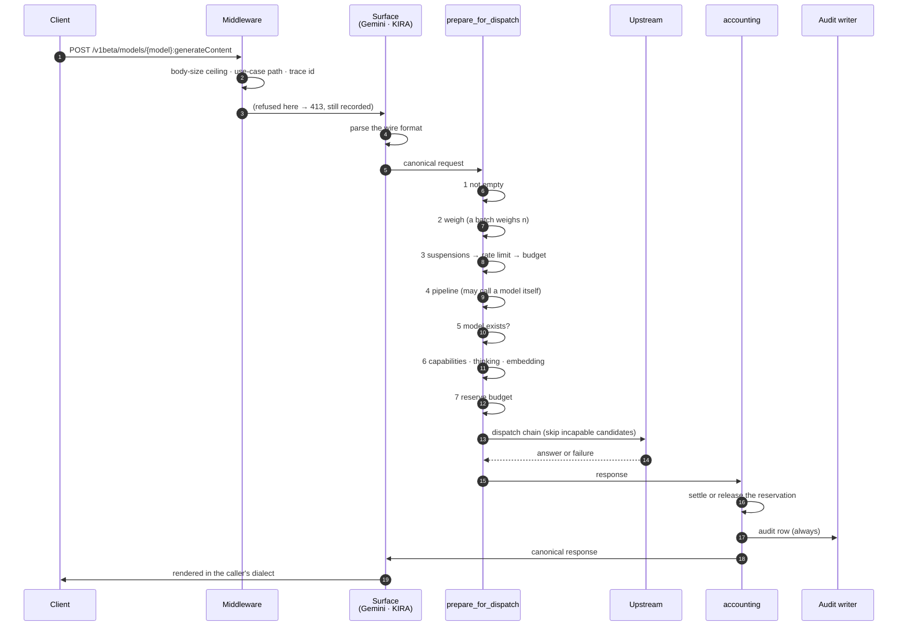
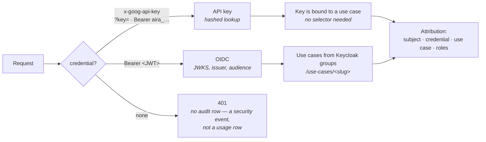
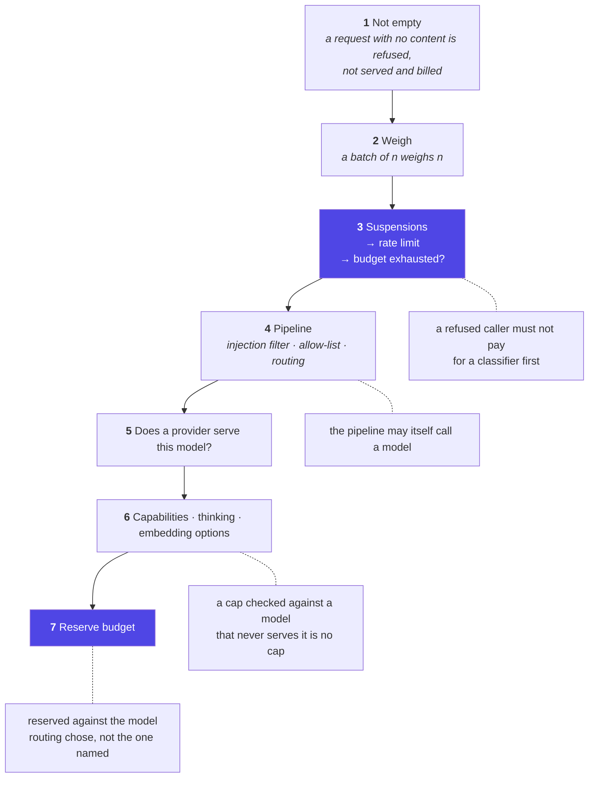
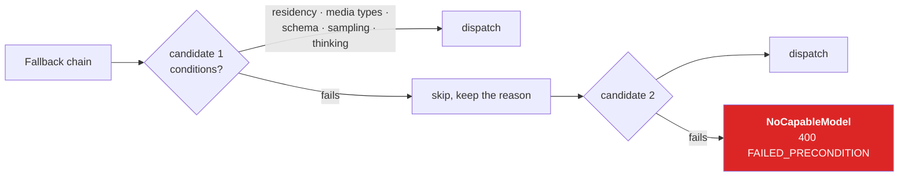
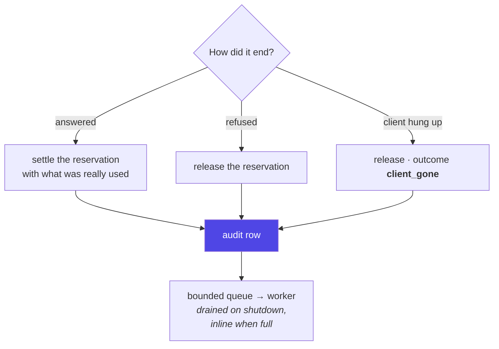
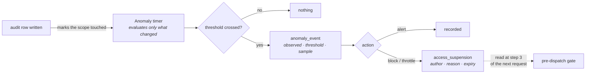

# One request, end to end

What happens between a client sending a prompt and receiving an answer — every control, in the
order it runs, and what each one costs if it is skipped.

The order is not incidental. It is owned by one function, `prepare_for_dispatch` in
[`gateway/src/aira_gateway/api/serving.py`](../gateway/src/aira_gateway/api/serving.py), because
**every guarantee this layer makes is a guarantee about the order**
([`FRD-126`](features/FRD-126-one-pre-dispatch-sequence.md)).

---

## 1. The whole path at a glance

---

## 2. Before any route: the middleware

Three things run outside the application, in this order (outermost first):

| Middleware              | Does                                            | If it refuses              |
| ----------------------- | ----------------------------------------------- | -------------------------- |
| `TraceIdMiddleware`     | puts `x-trace-id` on **every** response         | —                          |
| `UseCasePathMiddleware` | reads `/uc/<slug>` from the path                | 400 on an invalid slug     |
| body-size ceiling       | counts bytes, enforces `AIRA_MAX_REQUEST_BYTES` | **413**, and records a row |

The last one has two exits — a declared `Content-Length` that is too large, and a body that lies and
is cut off mid-read — and **both record an audit row** under the outcome `request_too_large`. That
row carries **no identity**: the credential was never verified at that point, and recording an
unverified claim would let anyone write another system's name into the audit trail with one
oversized request ([`FRD-122` §12](features/FRD-122-complete-audit-trail.md)).

The byte count it takes is also what `payload_size` anomaly rules measure against, so it is carried
onto the row rather than counted twice.

---

## 3. Authentication and attribution

Two credential kinds, one `Principal`:

- An **API key** (`aira_<prefix>_<secret>`, hashed at rest) is bound to its use case. A mismatched
  `/uc` selector or `X-AIRA-Use-Case` header is a **403**, not a silent override.
- An **OIDC bearer** carries realm roles and group memberships. Use-case membership comes from the
  group `/use-cases/<slug>`; a non-member gets 403.
- The **credential identity** (an API key's prefix, or the OIDC client id) travels onto the audit
  row separately from the subject. Without it, five keys issued for one use case by one person are
  one identity in the log, and a leaked key can be revoked but its blast radius cannot be assessed.

A **401 leaves no audit row**, and that is a decision: an unauthenticated request is a security
event, not a usage row attributed to nobody.

---

## 4. The pre-dispatch sequence

Seven steps, one owner. The right-hand column is what breaks if the step moves.

### 3 — the gate every verb passes

`guard_before_work` checks, in order: **suspensions** (is this caller stopped?), **rate limits**
(token bucket, all-or-nothing across use-case and member scopes), and **already over budget**.

It is called once, _before the verb branch_. Putting it inside the pipeline would have been tidier
and would have left `:embedContent` unlimited — embeddings have no pipeline. That verb is the reason
this project writes controls on the path every branch takes rather than inside one of them
([`FRD-405` B3](features/FRD-405-rate-limiting.md)).

**Cost of getting this wrong, measured:** with the pipeline running first, one served request and
seven refused ones spent 72 400 against a 20 000 cost limit — the refusals cost more than the answer.

### 4 — the pipeline

Per use case, config-driven, authored in the SPA's graph builder
([`FRD-300`](features/FRD-300-pipeline-engine.md),
[`FRD-303`](features/FRD-303-pipeline-builder-ui.md)):

| Step               | Does                                       | Notes                                                             |
| ------------------ | ------------------------------------------ | ----------------------------------------------------------------- |
| `injection_filter` | heuristic patterns, or an LLM classifier   | verdict is **three-valued**; `undetermined` **blocks** by default |
| `allow_check`      | model allow-list for the use case          |                                                                   |
| `model_route`      | an LLM classifier picks a category → model |                                                                   |

Then a `fallback_models` chain. **A pipeline model call is a first-class request**: it leaves its own
audit row named `pipeline:<step>`, priced, booked against the budget with `requests=0` — the caller
made one request. Measured against a real model, the classifier costs roughly as much as the answer
it guards ([`FRD-125`](features/FRD-125-pipeline-verdicts.md)).

A filter that ran and **passed** records that it did: "found nothing" and "none configured" used to
look identical.

### 6 — capabilities, per hop

The catalog is a **runtime authority** ([`FRD-114`](features/FRD-114-model-capability-metadata.md)):
output cap, per-model default cap, `generate`/`embed`, thinking modes, structured output,
attachments, deprecation. **Undeclared means the baseline and nothing more** — absence of
information is not permission.

Checked **after routing and at every hop of the fallback chain**, because a chain that quietly
answers with less than was asked for returns a 200.

**One capability is deliberately not a condition**: `prompt_caching`
([`FRD-133`](features/FRD-133-prompt-caching.md)). Every other flag guards the _answer_ — a
candidate that cannot read the attachment would answer about a document it never saw, so the chain
moves on. A candidate that cannot cache answers exactly the right thing and merely costs more, so
it is served **uncached** rather than skipped: refusing a request over a price is the opposite of
what a fallback chain is for. Resolved here all the same, because whether the request carries a
cache marker depends on the model it landed on and on the use case's own switch and lifetime.

### 7 — the reservation

Budgets **reserve** before dispatch and settle or release afterwards
([`FRD-405`](features/FRD-405-rate-limiting.md)). Without it, N concurrent requests all pass a limit
with room for one — proved by a test pair: 20/20 passed the old path, 1/20 the new.

---

## 5. Dispatch

A candidate that fails a condition is **skipped with its reason kept**, and the reasons reach the
audit row. An exhausted chain is a **400 FAILED_PRECONDITION**, not a 502: "every candidate was
excluded" is fixable by an operator, an outage is not.

Five conditions share this mechanism rather than each inventing one: **residency**
(one policy for every cloud), **media types**, the **schema** capability, **thinking**, and
**sampling expressibility** — the last is a property of the _dialect_, since no catalog entry can
say whether `top_k` exists.

**The rule that matters:** a model that cannot read the attachment is refused **by name**, never
sent the prompt without it. A dropped attachment produces no error — it produces a fluent wrong
answer with a 200, and the caller blames the model.

---

## 6. After the answer: `accounting`

One context manager owns every way out ([`FRD-128`](features/FRD-128-one-post-dispatch-sequence.md)):

The audit row carries: who and what system, which use case, requested **and** served model, how the
model was chosen, provider/publisher/**region**, status and outcome, pipeline decisions, tokens,
latency, cost in nano-units, request bytes, trace id, and which controls were degraded at the time.

**A request that reached this point is recorded however it ended.** Four of six paths once lost the
row when a caller went away mid-answer; a dropped socket _cancels_ the response task, so the settle
and the write are `asyncio.shield`ed.

**Refusals are recorded at the route's exception boundary** — one site, because a fact repeated at
every `return` is a fact eventually forgotten at one of them.

---

## 7. Asynchronously, afterwards

Detection is **asynchronous**, enforcement is **synchronous**, and they meet at a written decision
([`ADR-0014`](adr/ADR-0014-detection-is-asynchronous-enforcement-is-not.md)). The evaluator reads
the same rows the report reads — so it also sees refusals, which is where much of the signal is: a
thousand rate-limited requests _is_ the anomaly.

Also afterwards: the **retention worker** deletes stored prompts and responses once the use case's
period has passed (default 7 days). It must be scheduled or nothing is deleted.

---

## 8. What the caller sees when something refuses

| Situation                         | Status                                         | Outcome recorded            |
| --------------------------------- | ---------------------------------------------- | --------------------------- |
| Body over the ceiling             | 413                                            | `request_too_large`         |
| No credential                     | 401                                            | _(none — a security event)_ |
| Not a member of the use case      | 403                                            | `invalid_request`           |
| Stopped by a rule or an operator  | **429** + `Retry-After`                        | `suspended`                 |
| Over the rate limit               | 429 + `Retry-After`                            | `rate_limited`              |
| Over budget                       | 429                                            | `budget_exceeded`           |
| Blocked by the pipeline           | 403                                            | `blocked_by_pipeline`       |
| No candidate could serve it       | 400 `FAILED_PRECONDITION`                      | `no_capable_model`          |
| Unknown model                     | 404                                            | `model_not_found`           |
| Field this gateway does not serve | 400, **naming the field**                      | `invalid_request`           |
| Upstream said 400                 | 400 `FAILED_PRECONDITION`, carrying its reason | `upstream_error`            |
| Upstream 401/403                  | 502, **masked**                                | `upstream_error`            |
| Caller hung up                    | —                                              | `client_gone`               |

Two rules behind that table. **Nothing a request asks for is silently dropped**: a field this
gateway cannot honour is refused _by name_ with the reason, or the candidate is skipped — never
accepted and ignored. And an upstream's **credential** failures stay masked, because they are _our_
credentials, the caller cannot act on them, and the message may name one.

---

## 9. Where to look when something is wrong

| Question                       | Where                                                                |
| ------------------------------ | -------------------------------------------------------------------- |
| What happened to this request? | `request_logs`, by `trace_id` (also on the response as `x-trace-id`) |
| Why was it refused?            | the `outcome` column, and `pipeline_decisions`                       |
| Was a control degraded?        | the `degraded` column on that row                                    |
| Is anything stopped right now? | `GET /v1beta/suspensions` (incident role)                            |
| What has the detector found?   | `GET /v1beta/anomalies`                                              |
| Is the gateway healthy?        | `/healthz` (liveness), `/readyz` (readiness + upstream probes)       |
