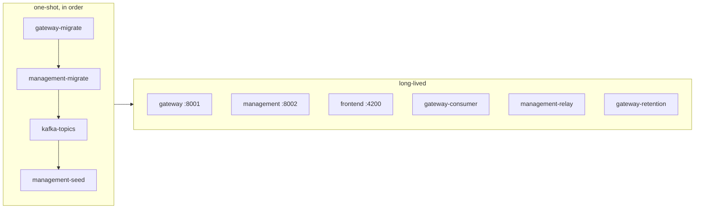
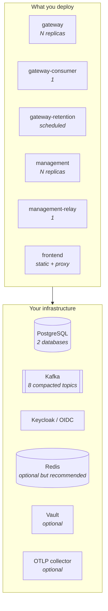
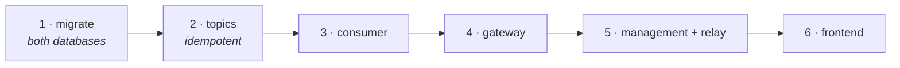

# Setup

Four ways to run AIRA Gateway, from "I want to look at it" to "I want it on our infrastructure".
Pick the row that matches your intent.

| I want to… | Read | Needs |
|---|---|---|
| See it working, with data and a real model | [§2 Demo](#2-demo--everything-including-a-real-model) | Docker |
| Run the whole thing locally, no source checkout beyond this repo | [§3 Standalone](#3-standalone--everything-in-containers) | Docker |
| Develop with reload-on-save | [§4 Development](#4-development--from-source-no-application-containers) | Docker, Python 3.14 + uv, Node 26 |
| Deploy onto existing infrastructure | [§5 Integrated](#5-integrated--onto-your-own-infrastructure) | see [`INTEGRATIONS.md`](INTEGRATIONS.md) |

Every configuration value is in [`CONFIGURATION.md`](CONFIGURATION.md). What each container is and
why is in [`ARCHITECTURE.md`](ARCHITECTURE.md).

---

## 1. Prerequisites

| Setup | Docker | Python 3.14 + [uv](https://docs.astral.sh/uv/) | Node 26 | Disk |
|---|:--:|:--:|:--:|---|
| Demo | ✅ | — | — | ~4 GB (model weights) |
| Standalone | ✅ | — | — | ~2 GB |
| Development | ✅ (infrastructure) | ✅ | ✅ | ~2 GB |
| Integrated | for images | — | — | — |

Versions are pinned ([`ADR-0003`](adr/ADR-0003-toolchain-versions.md)): `.python-version` and
`pyproject.toml` for Python, `.nvmrc` and `package.json` `engines` for Node. `make sync` installs
both dependency sets.

```bash
make help     # every target, with one line each
```

---

## 2. Demo — everything, including a real model

The fastest way to see the product rather than the infrastructure. Starts the stack, pulls a small
local model, seeds three use cases with budgets, rate limits, pipelines and API keys, and then
drives **real traffic** through the gateway — including a prompt injection the filter refuses.

```bash
make showcase
```

Then open <http://localhost:4200> and sign in. Every role sees something different, on purpose:

| User | Password | Sees |
|---|---|---|
| `admin` | `demo-password` | everything; the only role that may price a model |
| `ucadmin` | `demo-password` | administers **two** of the three use cases |
| `ucuser` | `demo-password` | member of one; read-only everywhere |
| `itsec` | `demo-password` | every use case's configuration; may stop traffic |
| `itgov` | `demo-password` | every use case and every figure; changes nothing |

`ucadmin` administering two of three is deliberate — switching to that account and finding two is
the fastest way to see the scoping is real rather than a filter in the frontend.

```bash
make showcase-traffic  # drive more traffic; the budget bars move
make down-full        # stop it (volumes and model weights are kept)
```

The model download is a separate step from the container's health check, so a restart does not look
like a hang. Details: [`FRD-130`](features/FRD-130-demo-showcase.md).

---

## 3. Standalone — everything in containers

Infrastructure plus all six application processes, on one machine, with nothing installed but
Docker.

```bash
make up-full
```



| Endpoint | URL |
|---|---|
| SPA | <http://localhost:4200> — override with `AIRA_FRONTEND_PORT` |
| Gateway | <http://localhost:8001> · `/healthz` `/readyz` `/docs` — `AIRA_GATEWAY_PORT` |
| Management API | <http://localhost:8002> · `/healthz` `/readyz` — `AIRA_MANAGEMENT_PORT` |
| Keycloak | <http://localhost:8080> (`admin` / `admin`) |
| Grafana (traces) | <http://localhost:3000> |

```bash
make ps            # status and health of every service
make logs-apps     # tail only the application containers
make down-full     # stop, keep volumes
make destroy       # stop and delete volumes (fresh state)
```

### Verifying it

```bash
curl -s localhost:8001/readyz | jq
```

`status: ready` with `degraded: false` means Postgres, Kafka and the counter store all answered.
`degraded: true` with a 200 is a **deliberate** state: the gateway still serves, with a named
control on a fallback ([`CONFIGURATION.md` §6](CONFIGURATION.md#6-what-happens-when-something-is-missing)).

---

## 4. Development — from source, no application containers

Infrastructure in Docker, the six processes from source with reload-on-save.

```bash
make sync              # Python (uv) + frontend (npm) dependencies
make up                # infrastructure only
make seed              # management DB: migrate + demo roles and users
make migrate-gateway   # gateway DB: Alembic migrations
make kafka-topics      # the compacted config topics (auto-create is OFF)
```

Then, each in its own terminal:

```bash
make run-gateway-oidc  # gateway         :8001
make run-backend       # management API  :8002
make consume           # config consumer (long-running)
make run-frontend      # SPA             :4200
```

### Two things that will catch you

**The relay is not running.** After changing members, keys, pipelines, budgets, limits or rules in
the UI, run `make relay` — that is how the gateway learns about them. `make up-full` runs it in a
loop for you.

**Use `run-gateway-oidc`, not `run-gateway`.** The SPA's dry-run and consumption views send the
browser's bearer token to the gateway, which needs OIDC enabled to validate it. Both degrade
gracefully without it, but the views will say they cannot show you anything.

### The test layers

```bash
make ci                # what CI checks: lint + types + unit tests with coverage gates
make test-integration  # against the live stack
make test-e2e          # real browser (Playwright)
make mutants           # break each guarded property and check the tests notice
```

Each layer exists for what the one below cannot see; the reasoning and the traps are in
[`TESTING.md`](TESTING.md).

---

## 5. Integrated — onto your own infrastructure

The applications are stateless containers. Point them at your Postgres, your Kafka, your Keycloak
and your model platforms; nothing else is required.



**Replica counts that matter:** the consumer and the relay are **single-writer** by design — run one
of each. The gateway and Management scale horizontally *provided* Redis is present; without it, rate
limits become per-instance and N replicas allow N × the limit.

**The retention worker must be scheduled** (hourly is what the Compose stack does). If nothing runs
it, nothing is ever deleted and the retention promise is a setting rather than a behaviour.

Everything else — which databases, which topics, which Keycloak clients and roles, which credentials
each model platform needs, TLS, and the SPA's build-time configuration — is in
**[`INTEGRATIONS.md`](INTEGRATIONS.md)**.

### Building the images

```bash
make build-images      # aira-gateway:dev, aira-management:dev, aira-frontend:dev
```

The SPA is configured **at build time**, not at run time: the OIDC issuer and client id are compiled
into the bundle. Building your own image is therefore part of deploying it —
[`INTEGRATIONS.md` §7](INTEGRATIONS.md#7-the-spa-is-configured-at-build-time).

---

## 6. Upgrading



Order matters in one place: **migrate before the new code starts**. Two hazards this project has
actually hit:

- An old container's `create_all` **resurrected a dropped table** and then failed every event
  against it. `create_all` alongside Alembic means a partially-deployed stack can undo a migration —
  production deployments run migrations as a one-shot job and nothing else creates tables.
- A new topic that nothing creates fails **silently**: Management accepts the change, the relay
  publishes, the broker drops it, and no error reaches anybody. Run the topic step on every upgrade;
  it is idempotent, and a test keeps the list in step with the code.

---

## 7. Troubleshooting

| Symptom | Likely cause |
|---|---|
| Configuration changes never reach the gateway | the relay is not running (`make relay`), or a topic is missing (`make kafka-topics`) |
| `/readyz` says `degraded: true` | Redis is unreachable — limits are per-instance, budgets use the Postgres path |
| The SPA shows "invalid credentials" everywhere | it should not any more; if it does, the session ended and the redirect failed — check the browser console for the OIDC error |
| A model answers `404 not found` | it is not in the catalog, or the name is wrong; `GET /v1beta/models` lists what this deployment serves |
| Keycloak has none of the AIRA roles | the realm is imported **only if it does not already exist** — recreate it, see [`deploy/compose/README.md`](../deploy/compose/README.md) |
| Nothing is ever deleted from `request_logs` payloads | the retention worker is not scheduled |
| A rule is configured and finds nothing | check `anomaly_rules` in the gateway database — if it is empty, the topic or the relay is the problem |
